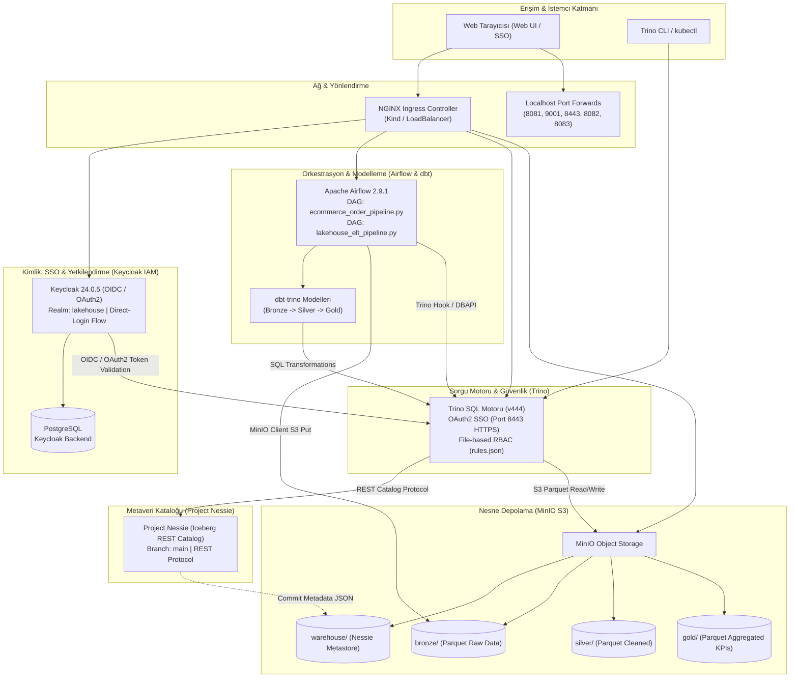

# Modern Open-Source Lakehouse Platform on Kubernetes

Kubernetes (Kind / k3s) üzerinde **Keycloak, MinIO, Nessie, Apache Iceberg, Trino, Apache Airflow ve dbt** bileşenlerinden oluşan, kurumsal düzeyde kimlik doğrulama (IAM/SSO) ve rol bazlı erişim denetimi (RBAC) ile korunan modern açık kaynak veri gölü (Lakehouse) platformu.

---

## 1. Mimari Şema



---

## 2. Dizin Yapısı

```text
lakehouse/
├── AGENTS.md                                # Ajan rolleri, yetkileri ve protokolleri
├── README.md                                # Platform mimarisi ve kapsamlı çalıştırma kılavuzu
├── infra/
│   ├── k8s/base/
│   │   └── namespace.yaml                   # lakehouse Kubernetes namespace
│   ├── ingress/
│   │   └── ingress-nginx                    # Kind NGINX Ingress Controller
│   ├── security/keycloak/
│   │   ├── postgres.yaml                    # Keycloak PostgreSQL backend deployment & service
│   │   ├── realm-configmap.yaml             # lakehouse realm, direct-login akışı, client ve roller
│   │   ├── keycloak.yaml                    # Keycloak deployment, service ve ingress
│   │   └── oidc-secrets.yaml                # Trino ve MinIO OIDC credential secret'ı
│   ├── storage/minio/
│   │   └── minio.yaml                       # MinIO S3 & otomatik bucket oluşturucu job
│   ├── catalog/nessie/
│   │   └── nessie.yaml                      # Nessie Iceberg REST kataloğu
│   └── engine/trino/
│       ├── trino-configmap.yaml             # iceberg.properties, rules.json (RBAC), OAuth2 config
│       └── trino.yaml                       # Trino koordinatör, HTTPS portu & ingress
├── orchestration/airflow/
│   ├── airflow.yaml                         # Airflow deployment & Postgres backend
│   ├── dags-configmap.yaml                  # Kubernetes ConfigMap DAG tanımları
│   └── dags/
│       ├── ingest_bronze_dag.py             # Açık REST API -> Bronze Iceberg DAG'ı
│       ├── lakehouse_elt_pipeline.py        # Master ELT Pipeline DAG'ı
│       └── ecommerce_order_pipeline.py      # E-Ticaret & Finansal Analitik Uçtan Uca Boru Hattı
└── transformations/
    ├── query_snapshots.sql                  # Iceberg snapshot ve metaveri sorguları
    ├── time_travel_demo.sql                 # Zaman yolculuğu & kaza kurtarma senaryosu
    └── dbt/
        ├── dbt_project.yml                  # dbt proje ayarları
        ├── profiles.yml                     # Trino bağlantı profili
        └── models/
            ├── bronze/sources.yml           # Bronze ham veri kaynak tanımı
            ├── silver/stg_users.sql         # Silver temizleme & tekilleştirme modeli
            └── gold/dim_users_summary.sql   # Gold analitik agregasyon modeli
```

---

## 3. Sıfırdan Adım Adım Kurulum (Pure `kubectl`)

Tüm platform herhangi bir bash betiğine ihtiyaç duymaksızın doğrudan saf `kubectl` komutlarıyla ayağa kalkar:

### Adım 1: Taban Altyapı ve Ingress
```powershell
# 1. Namespace
kubectl apply -f infra/k8s/base/namespace.yaml

# 2. Ingress Controller (Kind)
kubectl apply -f https://raw.githubusercontent.com/kubernetes/ingress-nginx/main/deploy/static/provider/kind/deploy.yaml
kubectl wait --namespace ingress-nginx --for=condition=ready pod --selector=app.kubernetes.io/component=controller --timeout=120s
```

### Adım 2: Kimlik Doğrulama Katmanı (Keycloak)
```powershell
# 1. PostgreSQL Backend
kubectl apply -f infra/security/keycloak/postgres.yaml
kubectl rollout status deployment/postgres-keycloak -n lakehouse

# 2. Realm, Direct-Login Akışı ve OIDC Tanımları
kubectl apply -f infra/security/keycloak/realm-configmap.yaml
kubectl apply -f infra/security/keycloak/keycloak.yaml
kubectl rollout status deployment/keycloak -n lakehouse --timeout=120s
kubectl apply -f infra/security/keycloak/oidc-secrets.yaml
```

### Adım 3: Depolama ve Metaveri Kataloğu (MinIO & Nessie)
```powershell
# 1. MinIO ve Otomatik Bucket Kurulumu (warehouse, bronze, silver, gold)
kubectl apply -f infra/storage/minio/minio.yaml
kubectl rollout status deployment/minio -n lakehouse
kubectl wait --for=condition=complete job/minio-create-buckets -n lakehouse --timeout=60s

# 2. Project Nessie Iceberg REST Catalog
kubectl apply -f infra/catalog/nessie/nessie.yaml
kubectl rollout status deployment/nessie -n lakehouse --timeout=60s
```

### Adım 4: Dağıtık SQL Motoru (Trino)
```powershell
# 1. Trino Iceberg, OAuth2 SSO ve RBAC Konfigürasyonu
kubectl apply -f infra/engine/trino/trino-configmap.yaml
kubectl apply -f infra/engine/trino/trino.yaml
kubectl rollout status deployment/trino -n lakehouse --timeout=120s
```

### Adım 5: Orkestrasyon & Veri Boru Hattı (Apache Airflow)
```powershell
# 1. Airflow Veritabanı Hazırlığı (Postgres)
kubectl exec -n lakehouse deployment/postgres-keycloak -- psql -U keycloak -d keycloak -c "CREATE DATABASE airflow;"

# 2. Airflow Dağıtımı & DAG'lar
kubectl apply -f orchestration/airflow/airflow.yaml
kubectl rollout status deployment/airflow -n lakehouse --timeout=120s
kubectl apply -f orchestration/airflow/dags-configmap.yaml
```

---

## 4. Kullanıcı Personaları ve Rol Matrisi

Keycloak üzerinde `lakehouse` realm'inde oluşturulmuş ve Trino `rules.json` ile yetkilendirilmiş kullanıcılar:

| Kullanıcı Adı | Parola | Keycloak Rolü | Bronze (Ham Veri) | Silver (Temiz Veri) | Gold (Analitik KPI) |
| :--- | :--- | :--- | :--- | :--- | :--- |
| **`demo-admin`** | `Admin@2026` | `admin` | ✅ Okuma / Yazma | ✅ Okuma / Yazma | ✅ Okuma / Yazma |
| **`demo-analyst`** | `Analyst@2026` | `data-analyst` | ❌ **Erişim Yasak** | 👁️ Yalnızca Okuma (SELECT) | 👁️ Yalnızca Okuma (SELECT) |

---

## 5. Doğrulama ve Test Senaryoları

### Test 1: Uçtan Uca E-Ticaret Veri Boru Hattı (Airflow)
Ham e-ticaret sipariş verisinin MinIO'ya aktarılıp Silver ve Gold Iceberg katmanlarına dönüştürülmesi:

```powershell
# Airflow üzerinden boru hattını tetikleme:
kubectl exec -n lakehouse deployment/airflow -- python3 -c "
from airflow.models import DagBag
from airflow.utils.state import State
import pendulum
dag = DagBag().get_dag('ecommerce_order_pipeline')
execution_date = pendulum.now()
dag.clear()
for task_id in ['ingest_raw_orders', 'transform_orders_silver', 'quality_checks_silver', 'aggregate_sales_gold']:
    task = dag.get_task(task_id)
    task.run(start_date=execution_date, end_date=execution_date, ignore_ti_state=True)
"

# Gold tablosundaki KPI sonuçlarını Trino üzerinden doğrulama:
kubectl exec -n lakehouse deployment/trino -- trino --execute "SELECT category, order_count, total_sales, avg_order_value FROM iceberg.gold.sales_financial_kpis ORDER BY total_sales DESC;"
```

### Test 2: Apache Iceberg Zaman Yolculuğu (Time Travel & Zero Data Loss)
Bozulan veya kazaen silinen verinin Iceberg snapshot metaverisiyle sıfır kayıpla kurtarılması:

```powershell
# 1. Mevcut snapshot geçmişini görüntüleme:
kubectl exec -n lakehouse deployment/trino -- trino --execute "SELECT snapshot_id, committed_at, operation FROM iceberg.bronze.\"orders\$snapshots\" ORDER BY committed_at DESC;"

# 2. Kaza simülasyonu (Tüm Elektronik siparişlerinin silinmesi):
kubectl exec -n lakehouse deployment/trino -- trino --execute "DELETE FROM iceberg.bronze.orders WHERE category = 'Electronics';"

# 3. Kalan kayıt sayısını görme (10'dan 6'ya düşer):
kubectl exec -n lakehouse deployment/trino -- trino --execute "SELECT count(*) AS remaining_count FROM iceberg.bronze.orders;"

# 4. Zaman Yolculuğu ile silinmiş veriyi snapshot üzerinden okuma (Örnek snapshot ID):
kubectl exec -n lakehouse deployment/trino -- trino --execute "SELECT count(*) AS historical_count, sum(amount) AS historical_amount FROM iceberg.bronze.orders FOR VERSION AS OF <SNAPSHOT_ID>;"

# 5. Sıfır Veri Kaybı ile silinen veriyi geri yükleme:
kubectl exec -n lakehouse deployment/trino -- trino --execute "INSERT INTO iceberg.bronze.orders SELECT * FROM iceberg.bronze.orders FOR VERSION AS OF <SNAPSHOT_ID> WHERE category = 'Electronics';"
```

### Test 3: Rol Bazlı Güvenlik Denetimi (Trino RBAC)
Analist ve admin kullanıcılarının yetki sınırlarının test edilmesi:

```powershell
# 1. Analyst kullanıcısı Gold katmanını sorunsuz okuyabilir:
kubectl exec -n lakehouse deployment/trino -- trino --user demo-analyst --execute "SELECT count(*) FROM iceberg.gold.sales_financial_kpis;"
# Sonuç: 4 (BAŞARILI)

# 2. Analyst kullanıcısı Bronze ham veri katmanına ERİŞEMEZ:
kubectl exec -n lakehouse deployment/trino -- trino --user demo-analyst --execute "SELECT count(*) FROM iceberg.bronze.orders;"
# Sonuç: Query failed: Access Denied: Cannot select from table iceberg.bronze.orders (ENGELLENDİ)

# 3. Analyst kullanıcısı tablodan kayıt SİLEMEZ:
kubectl exec -n lakehouse deployment/trino -- trino --user demo-analyst --execute "DELETE FROM iceberg.gold.sales_financial_kpis WHERE category = 'Books';"
# Sonuç: Query failed: Access Denied: Cannot delete from table iceberg.gold.sales_financial_kpis (ENGELLENDİ)

# 4. Admin kullanıcısı her iki katmana da tam erişir:
kubectl exec -n lakehouse deployment/trino -- trino --user demo-admin --execute "SELECT count(*) FROM iceberg.bronze.orders; SELECT count(*) FROM iceberg.gold.sales_financial_kpis;"
# Sonuç: 10 ve 4 (TAM ERİŞİM)
```

---

## 6. Web Arayüzleri ve Hızlı Erişim Matrisi

Servislere yerel bilgisayarınızdan bağlanmak için aşağıdaki port-forward komutlarını kullanabilirsiniz:

```powershell
# Keycloak IAM (Port 8081)
kubectl port-forward -n lakehouse svc/keycloak 8081:8080

# MinIO Console (Port 9001 - Keycloak SSO)
kubectl port-forward -n lakehouse svc/minio 9001:9001

# Trino Web UI (Port 8443 - Keycloak OAuth2 HTTPS)
kubectl port-forward -n lakehouse svc/trino 8443:8443

# Trino CLI / Internal (Port 8082 - HTTP)
kubectl port-forward -n lakehouse svc/trino 8082:8080

# Airflow Web UI (Port 8083)
kubectl port-forward -n lakehouse svc/airflow-webserver 8083:8080
```

| Servis | Adres / URL | Protokol | Kullanıcı / Parola | Açıklama |
| :--- | :--- | :--- | :--- | :--- |
| **Keycloak IAM** | `http://localhost:8081` | HTTP | `admin` / `admin` | Realm: `lakehouse`. İstemciler, roller ve kullanıcı yönetimi. |
| **Trino Web UI** | `https://localhost:8443/ui/` | HTTPS (OAuth2 SSO) | `demo-admin` (`Admin@2026`)<br>`demo-analyst` (`Analyst@2026`) | Keycloak üzerinden tek oturum açma, küme metrikleri ve çalışan sorgu analitiği. |
| **MinIO Console** | `http://localhost:9001` | HTTP (OIDC SSO) | `admin` / `Admin@123` *(veya SSO Butonu)* | `warehouse`, `bronze`, `silver`, `gold` bucket nesne depolama tarayıcısı. |
| **Apache Airflow** | `http://localhost:8083` | HTTP | `admin` / `FqEAqUgX8SNbqtDG` | `ecommerce_order_pipeline` ve `lakehouse_elt_pipeline` DAG yönetimi. |
| **Project Nessie** | Küme İçi: `http://nessie:19120` | REST API | Yok | Iceberg REST kataloğu ve `main` dalı metaveri işlemleri. |
