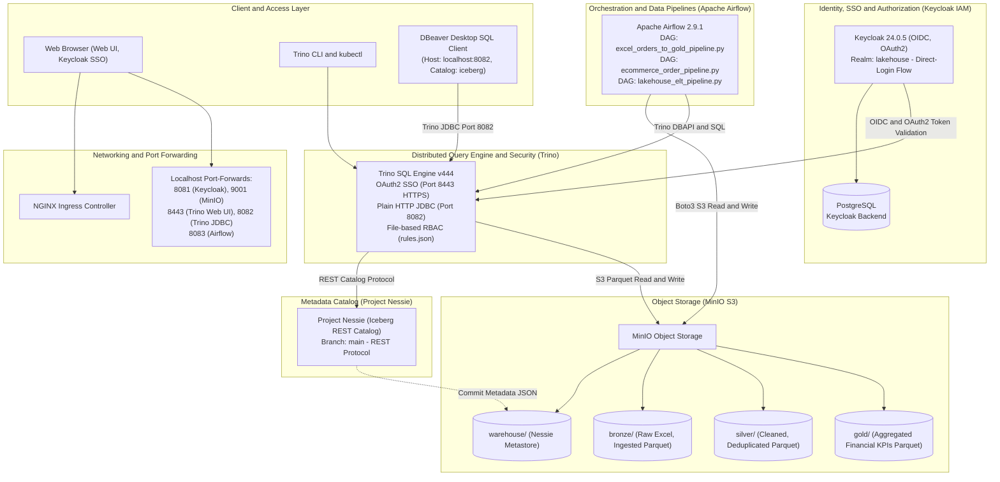
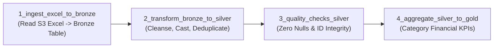

# Modern Open-Source Lakehouse Platform on Kubernetes

An enterprise-grade, end-to-end modern Lakehouse platform deployed natively on Kubernetes (Kind / k3s) leveraging **Keycloak (IAM/SSO), MinIO (S3 Object Storage), Project Nessie (Iceberg REST Catalog), Apache Iceberg (Table Format), Trino (Distributed SQL Query Engine), Apache Airflow (Orchestration), and dbt (Transformations)** with native **DBeaver** desktop client connectivity.

---

## 1. Architecture Overview



---

## 2. Directory Structure

```text
lakehouse/
├── .gitignore                               # Standard Python, dbt, OS, and local agent ignore rules
├── README.md                                # Comprehensive platform architecture & operational guide
├── WALKTHROUGH.md                           # Hands-on verification report & test logs
├── sample_orders.xlsx                       # Sample e-commerce dataset for interactive ingestion
├── infra/
│   ├── k8s/base/
│   │   └── namespace.yaml                   # 'lakehouse' Kubernetes namespace
│   ├── ingress/
│   │   └── ingress-nginx                    # Kind NGINX Ingress Controller manifests
│   ├── security/keycloak/
│   │   ├── postgres.yaml                    # Keycloak PostgreSQL backend deployment & service
│   │   ├── realm-configmap.yaml             # 'lakehouse' realm, direct-login flow, clients & roles
│   │   ├── keycloak.yaml                    # Keycloak deployment, service & ingress
│   │   └── oidc-secrets.yaml                # Shared OIDC/OAuth2 credentials secret
│   ├── storage/minio/
│   │   └── minio.yaml                       # MinIO S3 deployment & auto-bucket creation job
│   ├── catalog/nessie/
│   │   └── nessie.yaml                      # Nessie Iceberg REST catalog deployment & service
│   └── engine/trino/
│       ├── trino-configmap.yaml             # iceberg.properties, rules.json (RBAC), OAuth2 config
│       └── trino.yaml                       # Trino coordinator deployment, HTTPS service & ingress
├── orchestration/airflow/
│   ├── airflow.yaml                         # Airflow webserver & scheduler deployment with Postgres
│   ├── dags-configmap.yaml                  # Kubernetes ConfigMap mounting Airflow DAGs
│   └── dags/
│       ├── excel_to_gold_dag.py             # End-to-End Excel Medallion Pipeline (Bronze->Silver->Gold)
│       ├── ecommerce_order_pipeline.py      # E-Commerce Financial Analytics Pipeline
│       └── lakehouse_elt_pipeline.py        # Master ELT Pipeline
└── transformations/
    ├── query_snapshots.sql                  # Iceberg snapshot & metadata inspection queries
    ├── time_travel_demo.sql                 # Disaster recovery & Time Travel demonstration SQL
    ├── sql/
    │   ├── silver_excel_orders.sql          # Silver cleaning, deduplication & typing SQL model
    │   └── gold_excel_sales_kpis.sql        # Gold KPI analytical aggregation SQL model
    └── dbt/
        ├── dbt_project.yml                  # dbt project configuration
        ├── profiles.yml                     # Trino connection profile
        └── models/
            ├── bronze/sources.yml           # Bronze raw source definitions
            ├── silver/stg_users.sql         # Silver deduplication & typing model
            ├── silver/schema.yml            # Silver automated data quality & contract tests
            └── gold/dim_users_summary.sql   # Gold analytical aggregation model
```

---

## 3. Step-by-Step Base Deployment (Pure `kubectl`)

Deploy the entire lakehouse platform declaratively without any bash scripts. Each Kubernetes manifest is explained directly in sequence below:

### Step 1: Base Infrastructure & Ingress

```powershell
# 1. Create Lakehouse Namespace
kubectl apply -f infra/k8s/base/namespace.yaml
```
> **Manifest Breakdown — [`infra/k8s/base/namespace.yaml`](file:///c:/Users/Hp/projects/lakehouse/infra/k8s/base/namespace.yaml):**
> * **Purpose:** Establishes the dedicated `lakehouse` Kubernetes namespace.
> * **Role:** Provides an isolated administrative and network boundary ensuring all platform workloads (Keycloak, MinIO, Nessie, Trino, Airflow) run cleanly separated from default or system namespaces.

```powershell
# 2. Deploy NGINX Ingress Controller (Kind)
kubectl apply -f https://raw.githubusercontent.com/kubernetes/ingress-nginx/main/deploy/static/provider/kind/deploy.yaml
kubectl wait --namespace ingress-nginx --for=condition=ready pod --selector=app.kubernetes.io/component=controller --timeout=120s
```

---

### Step 2: Identity & Access Management (Keycloak)

```powershell
# 1. Deploy PostgreSQL Backend for Keycloak
kubectl apply -f infra/security/keycloak/postgres.yaml
kubectl rollout status deployment/postgres-keycloak -n lakehouse
```
> **Manifest Breakdown — [`infra/security/keycloak/postgres.yaml`](file:///c:/Users/Hp/projects/lakehouse/infra/security/keycloak/postgres.yaml):**
> * **Purpose:** Provisions a persistent PostgreSQL 15 database backend for Keycloak.
> * **Key Configurations:** Configures a PersistentVolumeClaim (`postgres-kc-pvc`), sets credentials (`user: keycloak`, `db: keycloak`), provisions readiness health probes, and exposes an internal ClusterIP service (`postgres-keycloak:5432`).

```powershell
# 2. Apply Realm Definitions & OIDC Clients
kubectl apply -f infra/security/keycloak/realm-configmap.yaml
```
> **Manifest Breakdown — [`infra/security/keycloak/realm-configmap.yaml`](file:///c:/Users/Hp/projects/lakehouse/infra/security/keycloak/realm-configmap.yaml):**
> * **Purpose:** Declarative JSON import defining the `lakehouse` security realm.
> * **Key Configurations:**
>   * Pre-registers OpenID Connect (OIDC) clients: `trino` (confidential client with secret `trino-client-secret-12345`) and `minio` (public client).
>   * Configures a custom `direct-login` browser authentication flow for immediate username/password sign-in.
>   * Defines platform roles: `admin` (super-admin), `data-engineer` (pipeline developer), and `data-analyst` (restricted read-only).

```powershell
# 3. Deploy Keycloak Identity Server
kubectl apply -f infra/security/keycloak/keycloak.yaml
kubectl rollout status deployment/keycloak -n lakehouse --timeout=120s
```
> **Manifest Breakdown — [`infra/security/keycloak/keycloak.yaml`](file:///c:/Users/Hp/projects/lakehouse/infra/security/keycloak/keycloak.yaml):**
> * **Purpose:** Runs Keycloak 24.0.5 in production-optimized mode.
> * **Key Configurations:** Connects to PostgreSQL using JDBC environment variables, mounts the realm configmap for auto-import on startup, exposes HTTP port `8080`, and configures an Ingress resource for `http://keycloak.local`.

```powershell
# 4. Create Shared OIDC Client Secrets
kubectl apply -f infra/security/keycloak/oidc-secrets.yaml
```
> **Manifest Breakdown — [`infra/security/keycloak/oidc-secrets.yaml`](file:///c:/Users/Hp/projects/lakehouse/infra/security/keycloak/oidc-secrets.yaml):**
> * **Purpose:** Stores shared OIDC authentication secrets as a Kubernetes Secret.
> * **Key Configurations:** Provides `KEYCLOAK_CLIENT_SECRET=trino-client-secret-12345` enabling Trino and MinIO to validate OAuth2 access tokens against Keycloak endpoints.

---

### Step 3: Storage & Metadata Catalog (MinIO & Nessie)

```powershell
# 1. Deploy MinIO & Automatically Provision Buckets
kubectl apply -f infra/storage/minio/minio.yaml
kubectl rollout status deployment/minio -n lakehouse
kubectl wait --for=condition=complete job/minio-create-buckets -n lakehouse --timeout=60s
```
> **Manifest Breakdown — [`infra/storage/minio/minio.yaml`](file:///c:/Users/Hp/projects/lakehouse/infra/storage/minio/minio.yaml):**
> * **Purpose:** Provides enterprise S3-compatible object storage for the lakehouse.
> * **Key Configurations:**
>   * Deploys MinIO server exposing port `9000` (S3 API) and port `9001` (Web Console).
>   * Includes an automated post-deploy Kubernetes `Job` (`minio-create-buckets`) using `minio/mc` CLI that automatically creates the required buckets on startup:
>     * `warehouse/` $\rightarrow$ Nessie catalog metadata storage
>     * `bronze/` $\rightarrow$ Raw uploaded files & ingested Parquet
>     * `silver/` $\rightarrow$ Cleansed and deduplicated Parquet
>     * `gold/` $\rightarrow$ Business aggregated analytical KPIs Parquet

```powershell
# 2. Deploy Project Nessie (Iceberg REST Catalog)
kubectl apply -f infra/catalog/nessie/nessie.yaml
kubectl rollout status deployment/nessie -n lakehouse --timeout=60s
```
> **Manifest Breakdown — [`infra/catalog/nessie/nessie.yaml`](file:///c:/Users/Hp/projects/lakehouse/infra/catalog/nessie/nessie.yaml):**
> * **Purpose:** Transactional catalog for Apache Iceberg implementing the REST Catalog specification.
> * **Key Configurations:** Runs Nessie on port `19120`. Manages table pointer commits, snapshot logs, and Git-like branching/tagging on the default `main` branch.

---

### Step 4: Distributed SQL Query Engine (Trino)

```powershell
# 1. Apply Trino Engine, Iceberg Catalog, Authentication & RBAC Configurations
kubectl apply -f infra/engine/trino/trino-configmap.yaml
```
> **Manifest Breakdown — [`infra/engine/trino/trino-configmap.yaml`](file:///c:/Users/Hp/projects/lakehouse/infra/engine/trino/trino-configmap.yaml):**
> * **Purpose:** The core configuration engine for Trino. Defines 5 critical sub-configurations:
>   * `config.properties`: Coordinator memory (2GB max, 1GB per node), HTTPS port `8443`, Keycloak OAuth2 SSO for the Web UI, and Bcrypt password authentication.
>   * `iceberg.properties`: Native Iceberg connector pointing to Nessie REST Catalog (`http://nessie.lakehouse.svc.cluster.local:19120/api/v1`) and MinIO S3 endpoint (`http://minio.lakehouse.svc.cluster.local:9000`).
>   * `password-authenticator.properties` & `password.db`: Built-in file-based password authenticator with Bcrypt `$2y$` hashes (`admin:Admin@2026`, `my-admin:Admin@2026`, `demo-analyst:Analyst@2026`).
>   * `rules.json`: Zero-Trust Role-Based Access Control matrix. Restricts `demo-analyst` to `SELECT` on `silver` and `gold` while denying `bronze`, and blocks unauthenticated/unknown users from discovering or querying `iceberg`.

```powershell
# 2. Deploy Trino Coordinator
kubectl apply -f infra/engine/trino/trino.yaml
kubectl rollout status deployment/trino -n lakehouse --timeout=120s
```
> **Manifest Breakdown — [`infra/engine/trino/trino.yaml`](file:///c:/Users/Hp/projects/lakehouse/infra/engine/trino/trino.yaml):**
> * **Purpose:** Runs the Trino v444 distributed SQL query coordinator.
> * **Key Configurations:**
>   * Startup hook automatically generates a Java Keystore (`/data/trino/keystore.jks`) for SSL/TLS encryption.
>   * Injects container bash aliases (`trino --server https://localhost:8443 --insecure`) enforcing password authentication even inside the pod.
>   * Exposes Service ports `8080` (HTTP) and `8443` (HTTPS) and provisions Ingress for `trino.local`.

---

### Step 5: Orchestration & Data Pipelines (Apache Airflow)

```powershell
# 1. Initialize Airflow Database in PostgreSQL
kubectl exec -n lakehouse deployment/postgres-keycloak -- psql -U keycloak -d keycloak -c "CREATE DATABASE airflow;"

# 2. Deploy Airflow Webserver & Scheduler
kubectl apply -f orchestration/airflow/airflow.yaml
kubectl rollout status deployment/airflow -n lakehouse --timeout=120s
```
> **Manifest Breakdown — [`orchestration/airflow/airflow.yaml`](file:///c:/Users/Hp/projects/lakehouse/orchestration/airflow/airflow.yaml):**
> * **Purpose:** Runs Apache Airflow 2.9.1 webserver and scheduler in a single container.
> * **Key Configurations:** Connects to PostgreSQL database `airflow` for metadata storage, sets `AIRFLOW__CORE__LOAD_EXAMPLES=False`, exposes Web UI on port `8080`, and mounts the DAG volume.

```powershell
# 3. Mount Pipeline DAGs via ConfigMap
kubectl apply -f orchestration/airflow/dags-configmap.yaml
```
> **Manifest Breakdown — [`orchestration/airflow/dags-configmap.yaml`](file:///c:/Users/Hp/projects/lakehouse/orchestration/airflow/dags-configmap.yaml):**
> * **Purpose:** Kubernetes ConfigMap storing DAG definitions. Mounted directly into `/opt/airflow/dags/` so pipelines are automatically discovered by the Airflow scheduler.

---

## 4. The 13-Step Hands-on End-to-End Tutorial

Follow this comprehensive, hands-on tutorial to experience every platform component across both Web UI and terminal CLI.

### Step 1: Create Admin User & Role in Keycloak UI
1. Open Keycloak Admin Console at **[http://localhost:8081](http://localhost:8081)**.
2. Sign in with master administrator credentials: `admin` / `admin`.
3. In the top-left dropdown, switch from `master` to the **`lakehouse`** realm.
4. Go to **Users** $\rightarrow$ **Add user**:
   * **Username:** `my-admin`
   * **Email:** `myadmin@lakehouse.local`
   * **First name:** `My` *(Required by Keycloak 24 User Profile)*
   * **Last name:** `Admin` *(Required by Keycloak 24 User Profile)*
   * **Email verified:** ON
   * Click **Create**.
5. Switch to the **Credentials** tab:
   * Click **Set password**.
   * **Password:** `Admin@2026`
   * **Temporary:** **OFF**.
   * Click **Save**.
6. Switch to the **Role mapping** tab:
   * Click **Assign role** $\rightarrow$ select **`admin`** $\rightarrow$ click **Assign**.

---

### Step 2: Manually Ingest Excel Data via MinIO Console UI
We provided a sample e-commerce dataset: [`sample_orders.xlsx`](file:///c:/Users/Hp/projects/lakehouse/sample_orders.xlsx) containing 10 orders:

| order_id | customer_name | category | amount | order_date | city |
| :--- | :--- | :--- | :--- | :--- | :--- |
| ORD-501 | Ali Vural | Electronics | 2500.00 | 2026-09-10 | Istanbul |
| ORD-502 | Ceren Kaya | Home | 350.50 | 2026-09-10 | Ankara |
| ORD-503 | Deniz Ak | Electronics | 1800.00 | 2026-09-10 | Izmir |
| ORD-504 | Eren Polat | Apparel | 120.00 | 2026-09-10 | Bursa |
| ORD-505 | Gamze Tekin | Books | 75.00 | 2026-09-10 | Antalya |
| ORD-506 | Hakan Demir | Electronics | 3200.00 | 2026-09-10 | Istanbul |
| ORD-507 | Ipek Yildirim | Home | 450.00 | 2026-09-10 | Izmir |
| ORD-508 | Kaan Ozturk | Apparel | 210.00 | 2026-09-10 | Ankara |
| ORD-509 | Leyla Sahin | Books | 95.00 | 2026-09-10 | Istanbul |
| ORD-510 | Murat Arda | Electronics | 1450.00 | 2026-09-10 | Bursa |

> **Dataset Overview — [`sample_orders.xlsx`](file:///c:/Users/Hp/projects/lakehouse/sample_orders.xlsx):**
> * **Structure:** Uncompressed raw Excel spreadsheet containing 10 multi-category e-commerce transactions.
> * **Schema:** `order_id` (VARCHAR), `customer_name` (VARCHAR), `category` (VARCHAR), `amount` (DOUBLE), `order_date` (VARCHAR), `city` (VARCHAR).
> * **Role in Pipeline:** Serves as the raw, unstructured source asset uploaded into the `bronze` S3 bucket to demonstrate ingestion into the ACID Lakehouse without prior conversion.

1. Open MinIO Console at **[http://localhost:9001](http://localhost:9001)**.
2. Sign in with `minioadmin` / `minioadmin` (or click the Keycloak SSO button).
3. In the left navigation, click **Buckets** $\rightarrow$ select **`bronze`**.
4. Click **Upload** $\rightarrow$ **Upload File**.
5. Select `sample_orders.xlsx` from your project folder and upload it directly into the `bronze` bucket.

---

### Step 3: Authored Medallion Pipeline DAG & SQL Transformations
The pipeline implements the full Lakehouse Medallion Architecture across 4 tasks:



> **Pipeline Architecture & Code Deep-Dive — [`excel_to_gold_dag.py`](file:///c:/Users/Hp/projects/lakehouse/orchestration/airflow/dags/excel_to_gold_dag.py):**
> * **Dependencies & Libraries:**
>   * `boto3`: S3 client connecting to MinIO (`http://minio.lakehouse.svc.cluster.local:9000`) with credentials `minioadmin:minioadmin`.
>   * `pandas` & `openpyxl`: Reads and parses the multi-column Excel binary stream in-memory without local disk bottlenecks.
>   * `trino.dbapi`: Connects to Trino distributed query engine via secure HTTPS port `8443` using `trino.auth.BasicAuthentication('admin', 'Admin@2026')`.
> * **Internal Functions & Task Flow:**
>   * `get_trino_cursor()`: Establishes a TLS-encrypted database connection to Trino (`host='trino.lakehouse.svc.cluster.local'`, `port=8443`, `http_scheme='https'`, `verify=False`, `auth=BasicAuthentication('admin', 'Admin@2026')`) ensuring zero credential leakage.
>   * `task_read_excel_and_load_bronze()`: Streams `sample_orders.xlsx` from bucket `bronze` in MinIO, parses into a DataFrame, executes `CREATE TABLE IF NOT EXISTS iceberg.bronze.excel_orders`, and inserts raw records with `ingested_at = NOW()`.
>   * `task_transform_silver()`: Executes [`transformations/sql/silver_excel_orders.sql`](file:///c:/Users/Hp/projects/lakehouse/transformations/sql/silver_excel_orders.sql). Standardizes strings with `TRIM()`, casts data types, and applies windowed deduplication `ROW_NUMBER() OVER (PARTITION BY order_id ORDER BY ingested_at DESC) = 1` into `iceberg.silver.excel_orders_cleaned` partitioned by `city`.
>   * `task_quality_checks_silver()`: Automated data contract validation asserting that duplicate order IDs count is `0` and non-positive/null amounts count is `0`, terminating with `ValueError` if any anomalies exist.
>   * `task_aggregate_gold()`: Executes [`transformations/sql/gold_excel_sales_kpis.sql`](file:///c:/Users/Hp/projects/lakehouse/transformations/sql/gold_excel_sales_kpis.sql), calculating total revenue, average order value, and order count grouped by category into business mart `iceberg.gold.excel_sales_kpis`.
>
> **Transformation SQL Files Executed by DAG:**
> * [`transformations/sql/silver_excel_orders.sql`](file:///c:/Users/Hp/projects/lakehouse/transformations/sql/silver_excel_orders.sql): Pure SQL model for cleansing, type casting, and deduplicating Bronze orders into Silver.
> * [`transformations/sql/gold_excel_sales_kpis.sql`](file:///c:/Users/Hp/projects/lakehouse/transformations/sql/gold_excel_sales_kpis.sql): Pure SQL model aggregating Silver cleaned transactions into actionable Gold business KPIs.
>
> **Accompanying Python Pipelines in Repository:**
> * [`ecommerce_order_pipeline.py`](file:///c:/Users/Hp/projects/lakehouse/orchestration/airflow/dags/ecommerce_order_pipeline.py): Simulates an automated transactional e-commerce pipeline generating `iceberg.bronze.orders`, `iceberg.silver.orders_cleaned`, and `iceberg.gold.sales_financial_kpis`.
> * [`lakehouse_elt_pipeline.py`](file:///c:/Users/Hp/projects/lakehouse/orchestration/airflow/dags/lakehouse_elt_pipeline.py): Master ELT orchestrator that coordinates raw data ingestion and executes dbt models.

---

### Step 4: Inject DAG into Airflow Pod via `kubectl cp`
In your terminal, copy the DAG script into the running Airflow pod:

```powershell
kubectl cp orchestration/airflow/dags/excel_to_gold_dag.py lakehouse/airflow-589d76d9f4-v8d8t:/opt/airflow/dags/excel_to_gold_dag.py
```
> **Execution Note — Injecting Python Pipelines:**
> `kubectl cp` copies the Python DAG directly into the Airflow container's DAG repository. The Airflow DAG processor re-evaluates the file within seconds, rendering the DAG immediately runnable on the Web UI without restarting the cluster.

---

### Step 5: Manually Trigger DAG in Airflow Web UI
1. Open Airflow Web UI at **[http://localhost:8083](http://localhost:8083)**.
2. Sign in with `admin` / `FqEAqUgX8SNbqtDG`.
3. Locate **`excel_orders_to_gold_pipeline`** and toggle it **Unpause** (blue).
4. Click into the DAG $\rightarrow$ click the **Trigger DAG (`▶`)** button on top right.
5. In the **Graph** view, monitor all 4 tasks turning dark green (`success`):
   * `1_ingest_excel_to_bronze` 🟩
   * `2_transform_bronze_to_silver` 🟩
   * `3_quality_checks_silver` 🟩
   * `4_aggregate_silver_to_gold` 🟩

---

### Step 6: Verify Medallion Storage in MinIO Console
In MinIO Console (**[http://localhost:9001](http://localhost:9001)**), observe the newly created Iceberg Parquet files and metadata:
* **`bronze/excel_orders/`** $\rightarrow$ Raw Parquet files and metadata.
* **`silver/excel_orders_cleaned/`** $\rightarrow$ Cleaned Parquet files.
* **`gold/excel_sales_kpis/`** $\rightarrow$ Aggregated KPI Parquet files.

---

### Step 7: Query Tables in Trino CLI
Connect to Trino CLI inside the pod using the administrative identity:

```powershell
kubectl exec -it -n lakehouse deployment/trino -- trino --catalog iceberg --user my-admin
```

> **Security & Identity Note:** 
> We explicitly pass `--user my-admin`. Because our RBAC authorization matrix ([`rules.json`](file:///c:/Users/Hp/projects/lakehouse/infra/engine/trino/trino-configmap.yaml)) strictly locks down the `iceberg` catalog against unauthenticated or unknown OS users (`trino`), attempting to connect without `--user` will result in `Access Denied: Cannot access catalog iceberg` when running `SHOW SCHEMAS`. Supplying `--user my-admin` identifies you with full administrative privileges.

Run queries to inspect the data layers:

```sql
-- View all schemas (bronze, silver, gold)
SHOW SCHEMAS;

-- View aggregated business KPIs in Gold layer
SELECT * FROM gold.excel_sales_kpis;

-- View raw ingested orders in Bronze layer (10 rows)
SELECT count(*) AS total_orders FROM bronze.excel_orders;
```

---

### Step 8: Accidental Deletion Simulation
In Trino CLI, simulate an operational error by deleting all Electronics orders:

```sql
DELETE FROM bronze.excel_orders WHERE category = 'Electronics';

-- Verify count drops from 10 to 6
SELECT count(*) AS remaining_orders FROM bronze.excel_orders;
```

---

### Step 9: Time Travel Query via Nessie & Iceberg Snapshots
Inspect the snapshot history to locate the healthy snapshot ID prior to deletion:

```sql
-- View snapshot commit log for excel_orders
SELECT snapshot_id, committed_at, operation 
FROM bronze."excel_orders$snapshots" 
ORDER BY committed_at DESC LIMIT 5;

-- Perform Time Travel query using the pre-incident snapshot ID
SELECT order_id, customer_name, category, amount 
FROM bronze.excel_orders FOR VERSION AS OF 5246354911498531800
WHERE category = 'Electronics';
```
*(All 4 deleted records appear directly from the past!)*

#### Practical Execution with [`transformations/query_snapshots.sql`](file:///c:/Users/Hp/projects/lakehouse/transformations/query_snapshots.sql)
Instead of typing queries manually, execute the pre-built snapshot inspection script directly from your terminal or desktop client:

```powershell
# In PowerShell: Pipe script directly into Trino CLI
Get-Content transformations/query_snapshots.sql | kubectl exec -i -n lakehouse deployment/trino -- trino --catalog iceberg --user my-admin

# In Linux / macOS / Git Bash:
kubectl exec -i -n lakehouse deployment/trino -- trino --catalog iceberg --user my-admin < transformations/query_snapshots.sql
```
*(Alternatively, open [`transformations/query_snapshots.sql`](file:///c:/Users/Hp/projects/lakehouse/transformations/query_snapshots.sql) in DBeaver and press `Alt+X` to run all statements).*

> **Script Overview — [`transformations/query_snapshots.sql`](file:///c:/Users/Hp/projects/lakehouse/transformations/query_snapshots.sql):**
> Provides diagnostic queries inspecting Apache Iceberg internal metadata tables (`$snapshots`, `$history`, `$manifests`, `$files`) across `bronze.excel_orders` and `bronze.orders`, enabling data engineers to inspect commit timestamps, operation types (`append`, `overwrite`, `delete`), and snapshot IDs.

---

### Step 10: Zero-Data-Loss Disaster Recovery
Restore the deleted rows with a single SQL statement in Trino CLI:

```sql
INSERT INTO bronze.excel_orders
SELECT * FROM bronze.excel_orders FOR VERSION AS OF 5246354911498531800
WHERE category = 'Electronics';

-- Verify table is 100% restored back to 10 records
SELECT count(*) AS total_orders FROM bronze.excel_orders;
```

#### Automated End-to-End Disaster Recovery Script: [`transformations/time_travel_demo.sql`](file:///c:/Users/Hp/projects/lakehouse/transformations/time_travel_demo.sql)
The repository provides a complete, automated end-to-end disaster recovery demonstration script that walks through the entire cycle (initial state $\rightarrow$ accidental deletion $\rightarrow$ damaged state verification $\rightarrow$ time-travel query $\rightarrow$ historical restoration $\rightarrow$ zero-loss validation).

Run it directly with a single command:

```powershell
# In PowerShell: Run automated disaster recovery playbook
Get-Content transformations/time_travel_demo.sql | kubectl exec -i -n lakehouse deployment/trino -- trino --catalog iceberg --user my-admin

# In Linux / macOS / Git Bash:
kubectl exec -i -n lakehouse deployment/trino -- trino --catalog iceberg --user my-admin < transformations/time_travel_demo.sql
```

**Observed Execution Output:**
```text
"1. INITIAL STATE BEFORE INCIDENT","10","5405.5"
DELETE: 4 rows
"2. DAMAGED STATE AFTER ACCIDENTAL DELETE","6","825.5"
"3. HISTORICAL SNAPSHOT VIA TIME TRAVEL","10","5405.5"
INSERT: 4 rows
"4. FINAL RESTORED STATE (ZERO DATA LOSS)","10","5405.5"
```
*(Or open [`transformations/time_travel_demo.sql`](file:///c:/Users/Hp/projects/lakehouse/transformations/time_travel_demo.sql) inside DBeaver and press `Alt+X` to watch all 6 phases execute interactively).*

> **Playbook Overview — [`transformations/time_travel_demo.sql`](file:///c:/Users/Hp/projects/lakehouse/transformations/time_travel_demo.sql):**
> Complete SQL playbook proving ACID rollback capabilities on Apache Iceberg. Demonstrates simulated data loss, discovers historical snapshot metadata, executes time-travel extraction, and achieves 100% zero-data-loss recovery without taking the platform offline.

---

### Step 11: Role-Based Access Control (RBAC) Security Verification
Compare permissions between the restricted analyst and the admin:

1. **Connect as `demo-analyst`:**
   ```powershell
   kubectl exec -it -n lakehouse deployment/trino -- trino --catalog iceberg --user demo-analyst
   ```
   * Query Gold: `SELECT * FROM gold.excel_sales_kpis;` $\rightarrow$ **ALLOWED (4 rows)**
   * Query Silver: `SELECT count(*) FROM silver.excel_orders_cleaned;` $\rightarrow$ **ALLOWED (10 rows)**
   * Query Bronze: `SELECT * FROM bronze.excel_orders;` $\rightarrow$ **BLOCKED: `Access Denied: Cannot select from table iceberg.bronze.excel_orders`**
   * Delete Gold: `DELETE FROM gold.excel_sales_kpis;` $\rightarrow$ **BLOCKED: `Access Denied: Cannot delete from table iceberg.gold.excel_sales_kpis`**

2. **Connect as `my-admin`:**
   ```powershell
   kubectl exec -it -n lakehouse deployment/trino -- trino --catalog iceberg --user my-admin
   ```
   * Query Bronze: `SELECT count(*) FROM bronze.excel_orders;` $\rightarrow$ **ALLOWED (10 rows - Full Access)**

---

### Step 12: Standalone DBeaver Desktop Client Integration (Enterprise Password Security)
Query the entire lakehouse platform visually using DBeaver while enforcing mandatory password verification to prevent identity spoofing:

#### Option A: Secure HTTPS Connection with Password Authentication (Recommended)
Trino is configured with a built-in Bcrypt Password Authenticator (`/etc/trino/password.db`) on HTTPS port `8443`:
1. Open **DBeaver** $\rightarrow$ **New Database Connection** $\rightarrow$ Select **Trino**.
2. **Main Settings:**
   * **Host:** `localhost`
   * **Port:** `8443`
   * **Database / Catalog:** `iceberg`
   * **Username:** `my-admin` *(or `demo-analyst`)*
   * **Password:** `Admin@2026` *(or `Analyst@2026`)*
3. **Driver Properties Tab:**
   * Set `SSL` to `true`
   * Set `SSLVerification` to `NONE` *(to accept self-signed development certificates)*
4. Click **Test Connection** $\rightarrow$ Observe **"Connected"**. Click **Finish**.
5. **Anti-Spoofing Security Verification:**
   * If a user enters `Username: my-admin` with an incorrect password or no password, Trino immediately rejects the connection with:
     `Access Denied: Invalid credentials (HTTP 401 Unauthorized)`
   * An analyst cannot masquerade as an administrator without possessing the admin's secret password!

#### Option B: Internal Development HTTP Connection (Port 8082)
For fast local testing without TLS certificates:
* **Host:** `localhost` | **Port:** `8082` | **Catalog:** `iceberg` | **SSL:** Unchecked

#### Browsing and Querying:
1. In the Database Navigator on the left, expand `iceberg` to browse `bronze`, `silver`, and `gold`.
2. Open SQL Editor (`F3`) and run:
   ```sql
   SELECT * FROM iceberg.gold.excel_sales_kpis;
   ```
   *(View the colored interactive data grid).*
3. Test RBAC in DBeaver: Connect as `demo-analyst` and query `iceberg.bronze.excel_orders` to observe the graphical **`Access Denied`** error dialog!

---

### Step 13: Declarative dbt Semantic Modeling & Governance (`transformations/dbt/`)
In enterprise lakehouses, raw data layers are modeled and governed using **dbt (data build tool)** with SQL-based declarative DAGs, schema tests, and documentation. The project includes a complete `dbt-trino` transformation project under [`transformations/dbt/`](file:///c:/Users/Hp/projects/lakehouse/transformations/dbt/):

> **dbt Models & Governance Architecture — [`transformations/dbt/`](file:///c:/Users/Hp/projects/lakehouse/transformations/dbt/):**
> * [`dbt_project.yml`](file:///c:/Users/Hp/projects/lakehouse/transformations/dbt/dbt_project.yml): The master manifest configuring the project `lakehouse_dbt`. Defines directory paths for models, tests, and seeds, connects to the `lakehouse_trino` profile, and instructs dbt to materialize Silver and Gold models as native Iceberg tables (`+materialized: table`).
> * [`profiles.yml`](file:///c:/Users/Hp/projects/lakehouse/transformations/dbt/profiles.yml): Defines the connection configuration (`lakehouse_trino`) targeting the in-cluster Trino coordinator (`trino.lakehouse.svc.cluster.local:8080`, database: `iceberg`, schema: `bronze`, 4 execution threads).
> * [`models/bronze/sources.yml`](file:///c:/Users/Hp/projects/lakehouse/transformations/dbt/models/bronze/sources.yml): Declarative source contract defining the raw ingested table `iceberg.bronze.raw_users` with detailed column descriptions (`id`, `name`, `username`, `email`, `city`, `company_name`, `ingested_at`) so upstream models can reference it with `{{ source('bronze', 'raw_users') }}`.
> * [`models/silver/stg_users.sql`](file:///c:/Users/Hp/projects/lakehouse/transformations/dbt/models/silver/stg_users.sql): Cleansing and standardization model. Reads raw users from Bronze, casts `id` to `INTEGER` and timestamps to `TIMESTAMP(6)`, applies string trimming and lowercase normalization on usernames and emails, filters out invalid null IDs, and outputs optimized Parquet tables into `iceberg.silver.stg_users`.
> * [`models/silver/schema.yml`](file:///c:/Users/Hp/projects/lakehouse/transformations/dbt/models/silver/schema.yml): Automated data quality testing specification for the Silver layer. Applies strict data integrity rules: asserts that `user_id` is both `unique` and `not_null`, and ensures `email_address` is `not_null`.
> * [`models/gold/dim_users_summary.sql`](file:///c:/Users/Hp/projects/lakehouse/transformations/dbt/models/gold/dim_users_summary.sql): Dimensional business mart aggregating users by city. Calculates `total_users`, `unique_companies`, first/last ingestion timestamps, and calculation time into `iceberg.gold.dim_users_summary`.

To run dbt transformations and data quality tests locally or from within a container:
```powershell
# Navigate to the dbt project directory
cd transformations/dbt

# Run models to materialize Silver and Gold Iceberg tables
dbt run --profiles-dir .

# Run automated data contract and uniqueness tests
dbt test --profiles-dir .
```

---

## 5. Web Interfaces & Port-Forwarding Quick Reference

Run these background port-forward commands to access all services locally:

```powershell
# Keycloak IAM (Port 8081)
kubectl port-forward -n lakehouse svc/keycloak 8081:8080

# MinIO Console (Port 9001 - Keycloak SSO)
kubectl port-forward -n lakehouse svc/minio 9001:9001

# Trino Web UI (Port 8443 - Keycloak OAuth2 HTTPS)
kubectl port-forward -n lakehouse svc/trino 8443:8443

# Trino JDBC / DBeaver / CLI (Port 8082 - HTTP)
kubectl port-forward -n lakehouse svc/trino 8082:8080

# Apache Airflow Web UI (Port 8083)
kubectl port-forward -n lakehouse svc/airflow-webserver 8083:8080
```

| Service | Address / URL | Protocol & Auth | Default Credentials | Description |
| :--- | :--- | :--- | :--- | :--- |
| **Trino Web UI** | `https://localhost:8443/ui/` | HTTPS (OAuth2 SSO) | `my-admin` (`Admin@2026`)<br>`demo-analyst` (`Analyst@2026`) | Cluster metrics, active query execution graphs, and RBAC logs. |
| **DBeaver (Trino JDBC)** | `localhost:8443` *(or `8082`)* | HTTPS *(or HTTP)* | `my-admin` (`Admin@2026`)<br>`demo-analyst` (`Analyst@2026`) | Desktop SQL client with mandatory password authentication and RBAC enforcement. |
| **Keycloak IAM** | `http://localhost:8081` | HTTP | `admin` / `admin` | Realm: `lakehouse`. Manage clients, roles, users, and SSO flows. |
| **MinIO Console** | `http://localhost:9001` | HTTP (OIDC SSO) | `minioadmin` / `minioadmin` *(or Keycloak SSO)* | S3 storage explorer for `warehouse`, `bronze`, `silver`, and `gold` buckets. |
| **Apache Airflow** | `http://localhost:8083` | HTTP | `admin` / `FqEAqUgX8SNbqtDG` | Orchestration dashboard for Medallion pipeline execution and scheduling. |
| **Project Nessie** | Cluster: `http://nessie:19120` | REST API | None | Iceberg REST catalog endpoint managing table commits on the `main` branch. |
