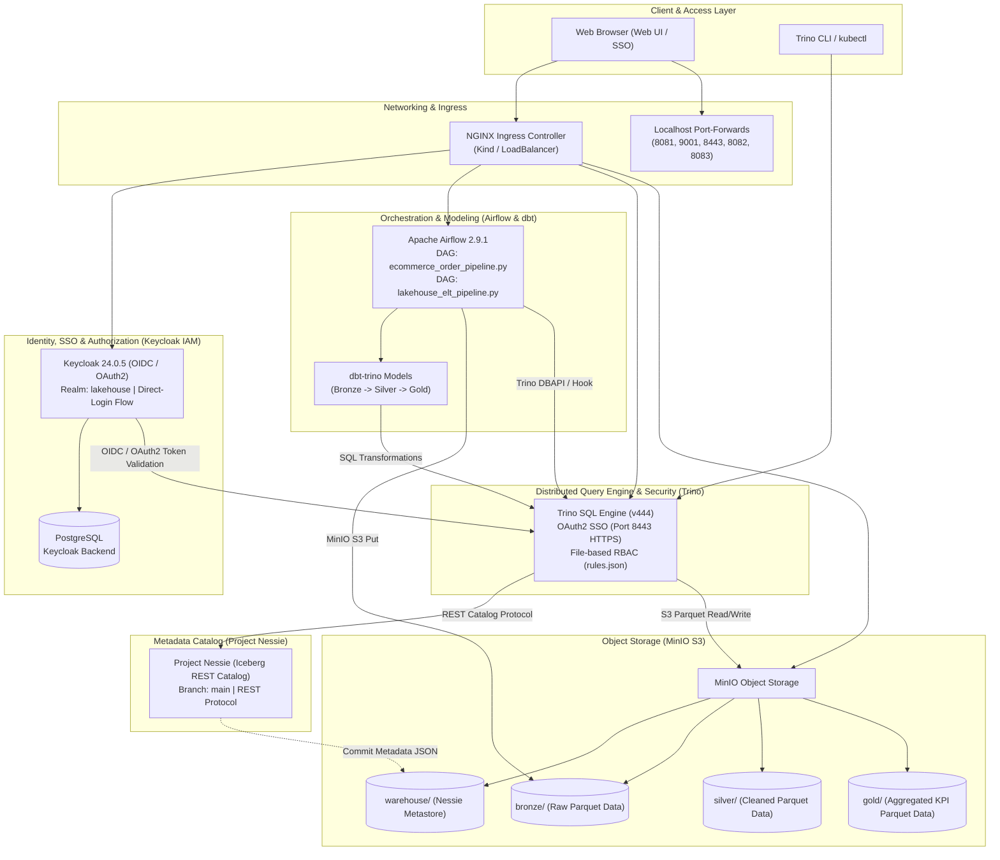

# Modern Open-Source Lakehouse Platform on Kubernetes

An end-to-end modern open-source Lakehouse platform on Kubernetes (Kind / k3s) built with **Keycloak, MinIO, Project Nessie, Apache Iceberg, Trino, Apache Airflow, and dbt**, protected by enterprise-grade identity and access management (IAM/OIDC/OAuth2 SSO) and fine-grained role-based access control (RBAC).

---

## 1. Architecture Overview



---

## 2. Directory Structure

```text
lakehouse/
├── .gitignore                               # Standard Python, dbt, OS, and agent ignored files
├── README.md                                # Comprehensive platform architecture & operational guide
├── infra/
│   ├── k8s/base/
│   │   └── namespace.yaml                   # 'lakehouse' Kubernetes namespace
│   ├── ingress/
│   │   └── ingress-nginx                    # Kind NGINX Ingress Controller manifests
│   ├── security/keycloak/
│   │   ├── postgres.yaml                    # Keycloak PostgreSQL backend deployment & service
│   │   ├── realm-configmap.yaml             # 'lakehouse' realm, direct-login flow, clients & roles
│   │   ├── keycloak.yaml                    # Keycloak deployment, service & ingress
│   │   └── oidc-secrets.yaml                # Shared OIDC/OAuth2 credentials secret
│   ├── storage/minio/
│   │   └── minio.yaml                       # MinIO S3 deployment & auto-bucket creation job
│   ├── catalog/nessie/
│   │   └── nessie.yaml                      # Nessie Iceberg REST catalog deployment & service
│   └── engine/trino/
│       ├── trino-configmap.yaml             # iceberg.properties, rules.json (RBAC), OAuth2 config
│       └── trino.yaml                       # Trino coordinator deployment, HTTPS service & ingress
├── orchestration/airflow/
│   ├── airflow.yaml                         # Airflow webserver & scheduler deployment with Postgres
│   ├── dags-configmap.yaml                  # Kubernetes ConfigMap mounting Airflow DAGs
│   └── dags/
│       ├── ingest_bronze_dag.py             # Open REST API -> Bronze Iceberg DAG
│       ├── lakehouse_elt_pipeline.py        # Master ELT Pipeline DAG
│       └── ecommerce_order_pipeline.py      # End-to-End E-Commerce & Financial Analytics Pipeline
└── transformations/
    ├── query_snapshots.sql                  # Iceberg snapshot & metadata inspection queries
    ├── time_travel_demo.sql                 # Disaster recovery & Time Travel demonstration SQL
    └── dbt/
        ├── dbt_project.yml                  # dbt project configuration
        ├── profiles.yml                     # Trino connection profile
        └── models/
            ├── bronze/sources.yml           # Bronze raw source definitions
            ├── silver/stg_users.sql         # Silver deduplication & typing model
            └── gold/dim_users_summary.sql   # Gold analytical aggregation model
```

---

## 3. Step-by-Step Pure `kubectl` Deployment

The platform is deployed declaratively using native `kubectl` commands without requiring external bash wrapper scripts:

### Step 1: Base Infrastructure & Ingress
```powershell
# 1. Create Lakehouse Namespace
kubectl apply -f infra/k8s/base/namespace.yaml

# 2. Deploy NGINX Ingress Controller (Kind)
kubectl apply -f https://raw.githubusercontent.com/kubernetes/ingress-nginx/main/deploy/static/provider/kind/deploy.yaml
kubectl wait --namespace ingress-nginx --for=condition=ready pod --selector=app.kubernetes.io/component=controller --timeout=120s
```

### Step 2: Identity & Access Management (Keycloak)
```powershell
# 1. Deploy PostgreSQL Backend
kubectl apply -f infra/security/keycloak/postgres.yaml
kubectl rollout status deployment/postgres-keycloak -n lakehouse

# 2. Apply Realm Definitions & Deploy Keycloak
kubectl apply -f infra/security/keycloak/realm-configmap.yaml
kubectl apply -f infra/security/keycloak/keycloak.yaml
kubectl rollout status deployment/keycloak -n lakehouse --timeout=120s
kubectl apply -f infra/security/keycloak/oidc-secrets.yaml
```

### Step 3: Storage & Metadata Catalog (MinIO & Nessie)
```powershell
# 1. Deploy MinIO & Automatically Provision Buckets (warehouse, bronze, silver, gold)
kubectl apply -f infra/storage/minio/minio.yaml
kubectl rollout status deployment/minio -n lakehouse
kubectl wait --for=condition=complete job/minio-create-buckets -n lakehouse --timeout=60s

# 2. Deploy Project Nessie (Iceberg REST Catalog)
kubectl apply -f infra/catalog/nessie/nessie.yaml
kubectl rollout status deployment/nessie -n lakehouse --timeout=60s
```

### Step 4: Distributed SQL Query Engine (Trino)
```powershell
# 1. Apply Trino Iceberg, OAuth2 SSO, and RBAC Configurations
kubectl apply -f infra/engine/trino/trino-configmap.yaml
kubectl apply -f infra/engine/trino/trino.yaml
kubectl rollout status deployment/trino -n lakehouse --timeout=120s
```

### Step 5: Orchestration & Data Pipelines (Apache Airflow)
```powershell
# 1. Initialize Airflow Database in PostgreSQL
kubectl exec -n lakehouse deployment/postgres-keycloak -- psql -U keycloak -d keycloak -c "CREATE DATABASE airflow;"

# 2. Deploy Airflow & Mount DAGs
kubectl apply -f orchestration/airflow/airflow.yaml
kubectl rollout status deployment/airflow -n lakehouse --timeout=120s
kubectl apply -f orchestration/airflow/dags-configmap.yaml
```

---

## 4. User Personas & RBAC Permission Matrix

Pre-configured users in the Keycloak `lakehouse` realm mapped into Trino's `rules.json` security policies:

| Username | Password | Keycloak Role | Bronze Layer (Raw) | Silver Layer (Cleaned) | Gold Layer (KPIs) |
| :--- | :--- | :--- | :--- | :--- | :--- |
| **`demo-admin`** | `Admin@2026` | `admin` | ✅ Full Read / Write | ✅ Full Read / Write | ✅ Full Read / Write |
| **`demo-analyst`** | `Analyst@2026` | `data-analyst` | ❌ **Access Denied** | 👁️ Read-Only (`SELECT`) | 👁️ Read-Only (`SELECT`) |

> [!NOTE]
> **SSO Session Invalidation:** Keycloak is configured with a custom `direct-login` browser authentication flow (omitting persistent cookie auto-login). Coupled with Trino's `end-session-url`, logging out of Trino immediately invalidates the Keycloak session, prompting the user for credentials on every login.

---

## 5. Verification & Demonstration Scenarios

### Scenario 1: End-to-End E-Commerce Data Pipeline (Airflow)
Trigger the automated pipeline ingesting raw orders into MinIO Bronze, transforming with window deduplication into Silver, running data quality assertions, and aggregating into Gold:

```powershell
# Trigger pipeline tasks sequentially via Airflow CLI:
kubectl exec -n lakehouse deployment/airflow -- python3 -c "
from airflow.models import DagBag
import pendulum
dag = DagBag().get_dag('ecommerce_order_pipeline')
execution_date = pendulum.now()
dag.clear()
for task_id in ['ingest_raw_orders', 'transform_orders_silver', 'quality_checks_silver', 'aggregate_sales_gold']:
    task = dag.get_task(task_id)
    task.run(start_date=execution_date, end_date=execution_date, ignore_ti_state=True)
"

# Validate Gold KPI results via Trino SQL:
kubectl exec -n lakehouse deployment/trino -- trino --execute "SELECT category, order_count, total_sales, avg_order_value FROM iceberg.gold.sales_financial_kpis ORDER BY total_sales DESC;"
```

### Scenario 2: Apache Iceberg Time Travel & Zero Data Loss Disaster Recovery
Demonstrating Iceberg's ACID snapshot metadata capabilities to recover from accidental data deletion:

```powershell
# 1. Inspect table snapshot commit history:
kubectl exec -n lakehouse deployment/trino -- trino --execute "SELECT snapshot_id, committed_at, operation FROM iceberg.bronze.\"orders\$snapshots\" ORDER BY committed_at DESC;"

# 2. Simulate disaster: Accidental deletion of all 'Electronics' orders:
kubectl exec -n lakehouse deployment/trino -- trino --execute "DELETE FROM iceberg.bronze.orders WHERE category = 'Electronics';"

# 3. Verify data loss (Record count drops from 10 to 6):
kubectl exec -n lakehouse deployment/trino -- trino --execute "SELECT count(*) AS remaining_count FROM iceberg.bronze.orders;"

# 4. Perform Time Travel query against historical snapshot before incident:
kubectl exec -n lakehouse deployment/trino -- trino --execute "SELECT count(*) AS historical_count, sum(amount) AS historical_amount FROM iceberg.bronze.orders FOR VERSION AS OF <SNAPSHOT_ID>;"

# 5. Restore deleted records with 100% zero data loss:
kubectl exec -n lakehouse deployment/trino -- trino --execute "INSERT INTO iceberg.bronze.orders SELECT * FROM iceberg.bronze.orders FOR VERSION AS OF <SNAPSHOT_ID> WHERE category = 'Electronics';"
```

### Scenario 3: Role-Based Access Control (RBAC) Security Verification
Testing boundary enforcement between analyst and admin personas:

```powershell
# 1. Analyst successfully queries Gold analytics layer:
kubectl exec -n lakehouse deployment/trino -- trino --user demo-analyst --execute "SELECT count(*) FROM iceberg.gold.sales_financial_kpis;"
# Result: 4 (SUCCESS)

# 2. Analyst is strictly BLOCKED from accessing Bronze raw data:
kubectl exec -n lakehouse deployment/trino -- trino --user demo-analyst --execute "SELECT count(*) FROM iceberg.bronze.orders;"
# Result: Query failed: Access Denied: Cannot select from table iceberg.bronze.orders (BLOCKED)

# 3. Analyst is strictly BLOCKED from modifying/deleting data:
kubectl exec -n lakehouse deployment/trino -- trino --user demo-analyst --execute "DELETE FROM iceberg.gold.sales_financial_kpis WHERE category = 'Books';"
# Result: Query failed: Access Denied: Cannot delete from table iceberg.gold.sales_financial_kpis (BLOCKED)

# 4. Admin persona enjoys full read/write access across all layers:
kubectl exec -n lakehouse deployment/trino -- trino --user demo-admin --execute "SELECT count(*) FROM iceberg.bronze.orders; SELECT count(*) FROM iceberg.gold.sales_financial_kpis;"
# Result: 10 and 4 (FULL ACCESS)
```

---

## 6. Web Interfaces & Quick Access Matrix

To connect to web user interfaces on your local machine, run the following background port-forward commands:

```powershell
# Keycloak IAM (Port 8081)
kubectl port-forward -n lakehouse svc/keycloak 8081:8080

# MinIO Console (Port 9001 - Keycloak SSO)
kubectl port-forward -n lakehouse svc/minio 9001:9001

# Trino Web UI (Port 8443 - Keycloak OAuth2 HTTPS)
kubectl port-forward -n lakehouse svc/trino 8443:8443

# Trino CLI / Internal (Port 8082 - HTTP)
kubectl port-forward -n lakehouse svc/trino 8082:8080

# Apache Airflow Web UI (Port 8083)
kubectl port-forward -n lakehouse svc/airflow-webserver 8083:8080
```

| Service | Local Address / URL | Protocol & Auth | Default Credentials | Description |
| :--- | :--- | :--- | :--- | :--- |
| **Trino Web UI** | `https://localhost:8443/ui/` | HTTPS (OAuth2 SSO) | `demo-admin` (`Admin@2026`)<br>`demo-analyst` (`Analyst@2026`) | Keycloak single sign-on, live cluster metrics, query execution trees, and RBAC logs. |
| **Keycloak IAM** | `http://localhost:8081` | HTTP | `admin` / `admin` | Realm: `lakehouse`. Manage clients, roles, users, and custom direct-login authentication flows. |
| **MinIO Console** | `http://localhost:9001` | HTTP (OIDC SSO) | `admin` / `Admin@123` *(or SSO button)* | Object storage browser for `warehouse`, `bronze`, `silver`, and `gold` buckets. |
| **Apache Airflow** | `http://localhost:8083` | HTTP | `admin` / `FqEAqUgX8SNbqtDG` | Orchestration DAG control panel, execution graphs, and scheduler status. |
| **Project Nessie** | Cluster: `http://nessie:19120` | REST API | None | Iceberg REST catalog endpoint managing table commits on the `main` branch. |
