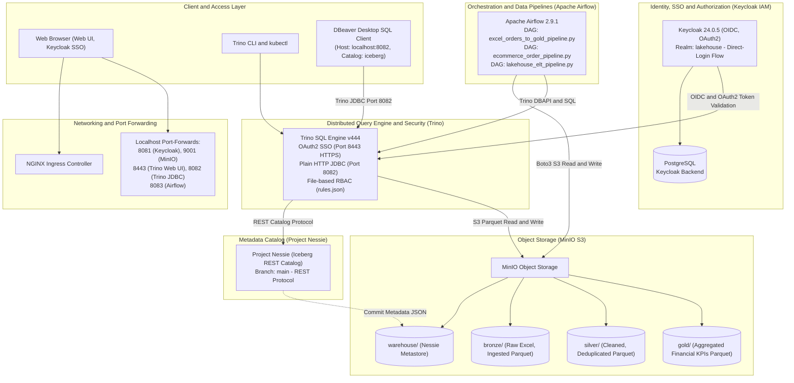

# Modern Open-Source Lakehouse Platform on Kubernetes

An enterprise-grade, end-to-end modern Lakehouse platform deployed natively on Kubernetes (Kind / k3s) leveraging **Keycloak (IAM/SSO), MinIO (S3 Object Storage), Project Nessie (Iceberg REST Catalog), Apache Iceberg (Table Format), Trino (Distributed SQL Query Engine), Apache Airflow (Orchestration), and dbt (Transformations)** with native **DBeaver** desktop client connectivity.

---

## 1. Architecture Overview



---

## 2. Directory Structure

```text
lakehouse/
├── .gitignore                               # Standard Python, dbt, OS, and local agent ignore rules
├── README.md                                # Comprehensive platform architecture & operational guide
├── WALKTHROUGH.md                           # Hands-on verification report & test logs
├── sample_orders.xlsx                       # Sample e-commerce dataset for interactive ingestion
├── infra/
│   ├── k8s/base/
│   │   └── namespace.yaml                   # 'lakehouse' Kubernetes namespace
│   ├── ingress/
│   │   └── ingress-nginx                    # Kind NGINX Ingress Controller manifests
│   ├── security/keycloak/
│   │   ├── postgres.yaml                    # Keycloak PostgreSQL backend deployment & service
│   │   ├── realm-configmap.yaml             # 'lakehouse' realm, direct-login flow, clients & roles
│   │   ├── keycloak.yaml                    # Keycloak deployment, service & ingress
│   │   └── oidc-secrets.yaml                # Shared OIDC/OAuth2 credentials secret
│   ├── storage/minio/
│   │   └── minio.yaml                       # MinIO S3 deployment & auto-bucket creation job
│   ├── catalog/nessie/
│   │   └── nessie.yaml                      # Nessie Iceberg REST catalog deployment & service
│   └── engine/trino/
│       ├── trino-configmap.yaml             # iceberg.properties, rules.json (RBAC), OAuth2 config
│       └── trino.yaml                       # Trino coordinator deployment, HTTPS service & ingress
├── orchestration/airflow/
│   ├── airflow.yaml                         # Airflow webserver & scheduler deployment with Postgres
│   ├── dags-configmap.yaml                  # Kubernetes ConfigMap mounting Airflow DAGs
│   └── dags/
│       ├── excel_to_gold_dag.py             # End-to-End Excel Medallion Pipeline (Bronze->Silver->Gold)
│       ├── ecommerce_order_pipeline.py      # E-Commerce Financial Analytics Pipeline
│       └── lakehouse_elt_pipeline.py        # Master ELT Pipeline
└── transformations/
    ├── query_snapshots.sql                  # Iceberg snapshot & metadata inspection queries
    ├── time_travel_demo.sql                 # Disaster recovery & Time Travel demonstration SQL
    ├── sql/
    │   ├── silver_excel_orders.sql          # Silver cleaning, deduplication & typing SQL model
    │   └── gold_excel_sales_kpis.sql        # Gold KPI analytical aggregation SQL model
    └── dbt/
        ├── dbt_project.yml                  # dbt project configuration
        ├── profiles.yml                     # Trino connection profile
        └── models/
            ├── bronze/sources.yml           # Bronze raw source definitions
            ├── silver/stg_users.sql         # Silver deduplication & typing model
            └── gold/dim_users_summary.sql   # Gold analytical aggregation model
```

---

## 3. Comprehensive File & Pipeline Catalog (Code Architecture)

This section provides an in-depth reference explaining the purpose, architecture, internal functions, and execution mechanics of every file in the repository, with special focus on the **Python (`.py`) orchestration pipelines**.

---

### 3.1 Python Data Pipelines (`orchestration/airflow/dags/`)

#### 1. [`excel_to_gold_dag.py`](file:///c:/Users/Hp/projects/lakehouse/orchestration/airflow/dags/excel_to_gold_dag.py) — End-to-End Excel Medallion Pipeline
* **Purpose:** Implements a production-grade Medallion Architecture (Bronze $\rightarrow$ Silver $\rightarrow$ Gold) processing raw Excel spreadsheets (`.xlsx`) directly into ACID Iceberg Parquet tables.
* **Libraries & Dependencies:**
  * `boto3`: Connects to MinIO S3 object storage endpoint (`http://minio.lakehouse.svc.cluster.local:9000`) using access key `minioadmin`.
  * `pandas` & `openpyxl`: Reads and parses the multi-column Excel binary stream in-memory without local disk bottlenecks.
  * `trino.dbapi`: Connects to Trino distributed query engine via secure HTTPS port `8443` using `trino.auth.BasicAuthentication('admin', 'Admin@2026')`.
* **Architecture & Task Flow:**
  ```mermaid
  flowchart LR
      T1["1_ingest_excel_to_bronze\n(Read S3 Excel -> Bronze Table)"] --> T2["2_transform_bronze_to_silver\n(Cleanse, Cast, Deduplicate)"]
      T2 --> T3["3_quality_checks_silver\n(Zero Nulls & ID Integrity)"]
      T3 --> T4["4_aggregate_silver_to_gold\n(Category Financial KPIs)"]
  ```
* **Internal Function Breakdown:**
  * `get_trino_cursor()`: Establishes a TLS-encrypted database connection to Trino (`host='trino.lakehouse.svc.cluster.local'`, `port=8443`, `http_scheme='https'`, `verify=False`, `auth=BasicAuthentication('admin', 'Admin@2026')`) ensuring zero credential leakage.
  * `task_read_excel_and_load_bronze()`:
    1. Fetches `sample_orders.xlsx` from bucket `bronze` in MinIO using `boto3.client('s3')`.
    2. Reads spreadsheet rows into a pandas DataFrame.
    3. Creates table `iceberg.bronze.excel_orders` if not exists with schema `(order_id, customer_name, category, amount, order_date, city, ingested_at)`.
    4. Appends records with current UTC ingestion timestamp (`ingested_at = NOW()`).
  * `task_transform_silver()`:
    1. Creates target table `iceberg.silver.excel_orders_cleaned` partitioned by `city`.
    2. Executes window deduplication: `ROW_NUMBER() OVER (PARTITION BY order_id ORDER BY ingested_at DESC) = 1`.
    3. Trims string whitespace and casts amounts to `DOUBLE` and dates to `VARCHAR`.
  * `task_quality_checks_silver()`:
    1. Executes automated data quality validation queries.
    2. Verifies that duplicate order IDs count is exactly `0`.
    3. Verifies that records with `amount <= 0` or null values count is exactly `0`.
    4. Raises `ValueError` to halt pipeline execution if anomalies are detected.
  * `task_aggregate_gold()`:
    1. Creates business KPI table `iceberg.gold.excel_sales_kpis`.
    2. Calculates `total_orders = COUNT(order_id)`, `total_revenue = SUM(amount)`, `avg_order_value = ROUND(AVG(amount), 2)`, and `top_city = ARBITRARY(city)` grouped by `category`.

---

#### 2. [`ecommerce_order_pipeline.py`](file:///c:/Users/Hp/projects/lakehouse/orchestration/airflow/dags/ecommerce_order_pipeline.py) — E-Commerce Financial Analytics Pipeline
* **Purpose:** Simulates an enterprise high-velocity transactional e-commerce pipeline generating orders across Bronze, Silver, and Gold layers.
* **Libraries & Dependencies:** `trino.dbapi`, `datetime`, `timedelta`.
* **Architecture & Task Flow:**
  * `task_ingest_orders_bronze()`: Creates table `iceberg.bronze.orders` with fields for `order_id`, `customer_name`, `customer_email`, `category`, `amount`, `payment_method`, `status`, `order_timestamp`, and `ingested_at`. Ingests 10 transactional purchase records.
  * `task_clean_orders_silver()`: Creates `iceberg.silver.orders_cleaned`. Cleans customer emails to lowercase, validates order status (`COMPLETED`, `PENDING`, `SHIPPED`), removes failed orders, and deduplicates transactions.
  * `task_sales_financial_kpis_gold()`: Computes multi-dimensional business metrics into `iceberg.gold.sales_financial_kpis`, summarizing total sales, average transaction size, and payment method share per category.

---

#### 3. [`lakehouse_elt_pipeline.py`](file:///c:/Users/Hp/projects/lakehouse/orchestration/airflow/dags/lakehouse_elt_pipeline.py) — Master Platform ELT Pipeline
* **Purpose:** Demonstrates master ELT ingestion and serves as the integration orchestrator for dbt models.
* **Libraries & Dependencies:** `trino.dbapi`, `airflow.models.DAG`.
* **Architecture & Task Flow:**
  * `task_ingest_bronze()`: Provisions `iceberg.bronze.raw_users` and seeds raw user interaction data.
  * `task_run_dbt_transformations()`: Triggers dbt compilation and execution against the Trino Iceberg catalog, elevating raw records into cleaned Silver staging models (`stg_users.sql`) and dimensional Gold marts (`dim_users_summary.sql`).
  * `task_validate_gold_kpis()`: Runs post-load reconciliation verifying record counts and schema consistency across the Medallion progression.

---

### 3.2 SQL Transformation & Audit Files (`transformations/`)

* [`transformations/sql/silver_excel_orders.sql`](file:///c:/Users/Hp/projects/lakehouse/transformations/sql/silver_excel_orders.sql): SQL script executed during Step 2 of the Excel Medallion pipeline. Standardizes text fields with `TRIM()`, cleans order dates, and uses `ROW_NUMBER() OVER (PARTITION BY order_id ORDER BY ingested_at DESC) = 1` for deduplication.
* [`transformations/sql/gold_excel_sales_kpis.sql`](file:///c:/Users/Hp/projects/lakehouse/transformations/sql/gold_excel_sales_kpis.sql): SQL aggregation script computing category-level sales metrics (`COUNT(*)`, `SUM(amount)`, `AVG(amount)`).
* [`transformations/time_travel_demo.sql`](file:///c:/Users/Hp/projects/lakehouse/transformations/time_travel_demo.sql): Complete SQL playbook demonstrating accidental data loss recovery. Shows how to query table snapshot history (`$snapshots`), query historical data (`FOR VERSION AS OF <snapshot_id>`), and perform instant single-query rollback.
* [`transformations/query_snapshots.sql`](file:///c:/Users/Hp/projects/lakehouse/transformations/query_snapshots.sql): Diagnostic queries inspecting Iceberg internal metadata tables (`$snapshots`, `$history`, `$manifests`, `$files`).

---

### 3.3 dbt (Data Build Tool) Semantic Models (`transformations/dbt/`)

* [`transformations/dbt/dbt_project.yml`](file:///c:/Users/Hp/projects/lakehouse/transformations/dbt/dbt_project.yml): Project-level configuration defining the project name, version, and model directory hierarchy.
* [`transformations/dbt/profiles.yml`](file:///c:/Users/Hp/projects/lakehouse/transformations/dbt/profiles.yml): Database connection profile targeting Trino coordinator with the Iceberg catalog.
* [`transformations/dbt/models/bronze/sources.yml`](file:///c:/Users/Hp/projects/lakehouse/transformations/dbt/models/bronze/sources.yml): Declarative source specification linking dbt models to `iceberg.bronze` raw tables.
* [`transformations/dbt/models/silver/stg_users.sql`](file:///c:/Users/Hp/projects/lakehouse/transformations/dbt/models/silver/stg_users.sql): Silver dbt model that casts user IDs, normalizes email casing, filters null records, and deduplicates user registrations.
* [`transformations/dbt/models/silver/schema.yml`](file:///c:/Users/Hp/projects/lakehouse/transformations/dbt/models/silver/schema.yml): Data quality tests for Silver models enforcing `unique` and `not_null` constraints.
* [`transformations/dbt/models/gold/dim_users_summary.sql`](file:///c:/Users/Hp/projects/lakehouse/transformations/dbt/models/gold/dim_users_summary.sql): Gold dimensional mart aggregating user counts by status and registration month.

---

### 3.4 Kubernetes Infrastructure Manifests (`infra/`)

#### Base & Security (`infra/k8s/base/` and `infra/security/keycloak/`)
* [`infra/k8s/base/namespace.yaml`](file:///c:/Users/Hp/projects/lakehouse/infra/k8s/base/namespace.yaml): Declares the `lakehouse` Kubernetes namespace isolating all cluster workloads.
* [`infra/security/keycloak/postgres.yaml`](file:///c:/Users/Hp/projects/lakehouse/infra/security/keycloak/postgres.yaml): Deploys PostgreSQL 15 database instance as the persistent metadata storage for Keycloak IAM.
* [`infra/security/keycloak/realm-configmap.yaml`](file:///c:/Users/Hp/projects/lakehouse/infra/security/keycloak/realm-configmap.yaml): Declarative export of the `lakehouse` Keycloak realm. Defines the `direct-login` authentication flow, OIDC clients (`trino`, `minio`), client redirect URIs, and predefined realm roles (`admin`, `data-engineer`, `data-analyst`).
* [`infra/security/keycloak/keycloak.yaml`](file:///c:/Users/Hp/projects/lakehouse/infra/security/keycloak/keycloak.yaml): Keycloak 24.0.5 deployment manifest, configuring JDBC connection to PostgreSQL, health probes, Service on port `8080`, and Ingress routing for `keycloak.local`.
* [`infra/security/keycloak/oidc-secrets.yaml`](file:///c:/Users/Hp/projects/lakehouse/infra/security/keycloak/oidc-secrets.yaml): Kubernetes Secret defining shared client credentials (`trino-client-secret-12345`).

#### Storage & Catalog (`infra/storage/minio/` and `infra/catalog/nessie/`)
* [`infra/storage/minio/minio.yaml`](file:///c:/Users/Hp/projects/lakehouse/infra/storage/minio/minio.yaml): Deploys MinIO S3 object storage server with API port `9000` and Console port `9001`. Includes the automated `minio-create-buckets` Kubernetes Job using `minio/mc` to initialize `warehouse`, `bronze`, `silver`, and `gold` buckets on startup.
* [`infra/catalog/nessie/nessie.yaml`](file:///c:/Users/Hp/projects/lakehouse/infra/catalog/nessie/nessie.yaml): Deploys Project Nessie REST catalog on port `19120`. Manages table references, commit trees, and Iceberg metadata pointers on git-like branches (default `main`).

#### Query Engine (`infra/engine/trino/`)
* [`infra/engine/trino/trino-configmap.yaml`](file:///c:/Users/Hp/projects/lakehouse/infra/engine/trino/trino-configmap.yaml): Central Trino coordinator configuration:
  * `config.properties`: Coordinates memory, HTTPS on port `8443`, Keycloak OAuth2 SSO integration for Web UI, and file-based password authentication.
  * `iceberg.properties`: Configures Iceberg connector pointing to Nessie REST Catalog (`http://nessie:19120/api/v1`) and MinIO S3 endpoint (`http://minio:9000`).
  * `password.db`: Bcrypt hashed password database enforcing strict authentication (`admin:Admin@2026`, `my-admin:Admin@2026`, `demo-analyst:Analyst@2026`).
  * `rules.json`: Zero-Trust Role-Based Access Control matrix. Restricts `demo-analyst` to `SELECT` on `silver` and `gold` while denying `bronze`, and denies all access to unauthenticated/unknown users.
* [`infra/engine/trino/trino.yaml`](file:///c:/Users/Hp/projects/lakehouse/infra/engine/trino/trino.yaml): Trino coordinator deployment manifest. Automatically generates JKS TLS certificate on startup, configures container bash aliases to enforce HTTPS CLI access, and exposes ports `8080` (HTTP) and `8443` (HTTPS).

#### Orchestration (`orchestration/airflow/`)
* [`orchestration/airflow/airflow.yaml`](file:///c:/Users/Hp/projects/lakehouse/orchestration/airflow/airflow.yaml): Deploys Apache Airflow 2.9.1 webserver and scheduler in a single container. Mounts DAG directory from ConfigMap and connects to the PostgreSQL metadata database.
* [`orchestration/airflow/dags-configmap.yaml`](file:///c:/Users/Hp/projects/lakehouse/orchestration/airflow/dags-configmap.yaml): Kubernetes ConfigMap storing DAG code to inject DAGs into Airflow pods declaratively.

---

### 3.5 Datasets & Project Documentation
* [`sample_orders.xlsx`](file:///c:/Users/Hp/projects/lakehouse/sample_orders.xlsx): Raw e-commerce sample spreadsheet (10 orders across Electronics, Apparel, Books, Home) used in the interactive Medallion tutorial.
* [`WALKTHROUGH.md`](file:///c:/Users/Hp/projects/lakehouse/WALKTHROUGH.md): Verification report containing execution evidence, test logs, CLI outputs, and validation receipts across all 12 tutorial steps.
* [`README.md`](file:///c:/Users/Hp/projects/lakehouse/README.md): Master technical guide and architectural blueprint for the entire lakehouse platform.

---

## 4. Step-by-Step Base Deployment (Pure `kubectl`)

Deploy the entire lakehouse platform declaratively without any bash scripts:

### Step 1: Base Infrastructure & Ingress
```powershell
# 1. Create Lakehouse Namespace
kubectl apply -f infra/k8s/base/namespace.yaml

# 2. Deploy NGINX Ingress Controller (Kind)
kubectl apply -f https://raw.githubusercontent.com/kubernetes/ingress-nginx/main/deploy/static/provider/kind/deploy.yaml
kubectl wait --namespace ingress-nginx --for=condition=ready pod --selector=app.kubernetes.io/component=controller --timeout=120s
```

### Step 2: Identity & Access Management (Keycloak)
```powershell
# 1. Deploy PostgreSQL Backend
kubectl apply -f infra/security/keycloak/postgres.yaml
kubectl rollout status deployment/postgres-keycloak -n lakehouse

# 2. Apply Realm Definitions & Deploy Keycloak
kubectl apply -f infra/security/keycloak/realm-configmap.yaml
kubectl apply -f infra/security/keycloak/keycloak.yaml
kubectl rollout status deployment/keycloak -n lakehouse --timeout=120s
kubectl apply -f infra/security/keycloak/oidc-secrets.yaml
```

### Step 3: Storage & Metadata Catalog (MinIO & Nessie)
```powershell
# 1. Deploy MinIO & Automatically Provision Buckets (warehouse, bronze, silver, gold)
kubectl apply -f infra/storage/minio/minio.yaml
kubectl rollout status deployment/minio -n lakehouse
kubectl wait --for=condition=complete job/minio-create-buckets -n lakehouse --timeout=60s

# 2. Deploy Project Nessie (Iceberg REST Catalog)
kubectl apply -f infra/catalog/nessie/nessie.yaml
kubectl rollout status deployment/nessie -n lakehouse --timeout=60s
```

### Step 4: Distributed SQL Query Engine (Trino)
```powershell
# 1. Apply Trino Iceberg, OAuth2 SSO, and RBAC Configurations
kubectl apply -f infra/engine/trino/trino-configmap.yaml
kubectl apply -f infra/engine/trino/trino.yaml
kubectl rollout status deployment/trino -n lakehouse --timeout=120s
```

### Step 5: Orchestration & Data Pipelines (Apache Airflow)
```powershell
# 1. Initialize Airflow Database in PostgreSQL
kubectl exec -n lakehouse deployment/postgres-keycloak -- psql -U keycloak -d keycloak -c "CREATE DATABASE airflow;"

# 2. Deploy Airflow & Mount DAGs
kubectl apply -f orchestration/airflow/airflow.yaml
kubectl rollout status deployment/airflow -n lakehouse --timeout=120s
kubectl apply -f orchestration/airflow/dags-configmap.yaml
```

---

## 5. The 12-Step Hands-on End-to-End Tutorial

Follow this comprehensive, hands-on tutorial to experience every platform component across both Web UI and terminal CLI.

### Step 1: Create Admin User & Role in Keycloak UI
1. Open Keycloak Admin Console at **[http://localhost:8081](http://localhost:8081)**.
2. Sign in with master administrator credentials: `admin` / `admin`.
3. In the top-left dropdown, switch from `master` to the **`lakehouse`** realm.
4. Go to **Users** $\rightarrow$ **Add user**:
   * **Username:** `my-admin`
   * **Email:** `myadmin@lakehouse.local`
   * **First name:** `My` *(Required by Keycloak 24 User Profile)*
   * **Last name:** `Admin` *(Required by Keycloak 24 User Profile)*
   * **Email verified:** ON
   * Click **Create**.
5. Switch to the **Credentials** tab:
   * Click **Set password**.
   * **Password:** `Admin@2026`
   * **Temporary:** **OFF**.
   * Click **Save**.
6. Switch to the **Role mapping** tab:
   * Click **Assign role** $\rightarrow$ select **`admin`** $\rightarrow$ click **Assign**.

---

### Step 2: Manually Ingest Excel Data via MinIO Console UI
We provided a sample e-commerce dataset: [`sample_orders.xlsx`] containing 10 orders:

| order_id | customer_name | category | amount | order_date | city |
| :--- | :--- | :--- | :--- | :--- | :--- |
| ORD-501 | Ali Vural | Electronics | 2500.00 | 2026-09-10 | Istanbul |
| ORD-502 | Ceren Kaya | Home | 350.50 | 2026-09-10 | Ankara |
| ORD-503 | Deniz Ak | Electronics | 1800.00 | 2026-09-10 | Izmir |
| ORD-504 | Eren Polat | Apparel | 120.00 | 2026-09-10 | Bursa |
| ORD-505 | Gamze Tekin | Books | 75.00 | 2026-09-10 | Antalya |
| ORD-506 | Hakan Demir | Electronics | 3200.00 | 2026-09-10 | Istanbul |
| ORD-507 | Ipek Yildirim | Home | 450.00 | 2026-09-10 | Izmir |
| ORD-508 | Kaan Ozturk | Apparel | 210.00 | 2026-09-10 | Ankara |
| ORD-509 | Leyla Sahin | Books | 95.00 | 2026-09-10 | Istanbul |
| ORD-510 | Murat Arda | Electronics | 1450.00 | 2026-09-10 | Bursa |

1. Open MinIO Console at **[http://localhost:9001](http://localhost:9001)**.
2. Sign in with `minioadmin` / `minioadmin` (or click the Keycloak SSO button).
3. In the left navigation, click **Buckets** $\rightarrow$ select **`bronze`**.
4. Click **Upload** $\rightarrow$ **Upload File**.
5. Select `sample_orders.xlsx` from your project folder and upload it directly into the `bronze` bucket.

---

### Step 3: Authored Medallion Pipeline DAG & SQL Transformations
The pipeline implements the full Lakehouse Medallion Architecture across 4 tasks:
1. **`1_ingest_excel_to_bronze`:** Uses `boto3` and `pandas` to read `s3://bronze/sample_orders.xlsx` and writes raw records into `iceberg.bronze.excel_orders`.
2. **`2_transform_bronze_to_silver`:** Executes [`transformations/sql/silver_excel_orders.sql`], applying SQL window deduplication (`ROW_NUMBER() OVER (PARTITION BY order_id ORDER BY ingested_at DESC) = 1`), trimming whitespace, casting dates, and writing to `iceberg.silver.excel_orders_cleaned`.
3. **`3_quality_checks_silver`:** Validates that duplicate IDs and amounts $\le 0$ yield **0** violations.
4. **`4_aggregate_silver_to_gold`:** Executes [`transformations/sql/gold_excel_sales_kpis.sql`], aggregating category metrics into `iceberg.gold.excel_sales_kpis`.

---

### Step 4: Inject DAG into Airflow Pod via `kubectl cp`
In your terminal, copy the DAG script into the running Airflow pod:

```powershell
kubectl cp orchestration/airflow/dags/excel_to_gold_dag.py lakehouse/airflow-589d76d9f4-v8d8t:/opt/airflow/dags/excel_to_gold_dag.py
```

---

### Step 5: Manually Trigger DAG in Airflow Web UI
1. Open Airflow Web UI at **[http://localhost:8083](http://localhost:8083)**.
2. Sign in with `admin` / `FqEAqUgX8SNbqtDG`.
3. Locate **`excel_orders_to_gold_pipeline`** and toggle it **Unpause** (blue).
4. Click into the DAG $\rightarrow$ click the **Trigger DAG (`▶`)** button on top right.
5. In the **Graph** view, monitor all 4 tasks turning dark green (`success`):
   * `1_ingest_excel_to_bronze` 🟩
   * `2_transform_bronze_to_silver` 🟩
   * `3_quality_checks_silver` 🟩
   * `4_aggregate_silver_to_gold` 🟩

---

### Step 6: Verify Medallion Storage in MinIO Console
In MinIO Console (**[http://localhost:9001](http://localhost:9001)**), observe the newly created Iceberg Parquet files and metadata:
* **`bronze/excel_orders/`** $\rightarrow$ Raw Parquet files and metadata.
* **`silver/excel_orders_cleaned/`** $\rightarrow$ Cleaned Parquet files.
* **`gold/excel_sales_kpis/`** $\rightarrow$ Aggregated KPI Parquet files.

---

### Step 7: Query Tables in Trino CLI
Connect to Trino CLI inside the pod:

```powershell
kubectl exec -it -n lakehouse deployment/trino -- trino --catalog iceberg
```

Run queries to inspect the data layers:

```sql
-- View all layers
SHOW SCHEMAS;

-- View aggregated business KPIs in Gold layer
SELECT * FROM gold.excel_sales_kpis;

-- View raw ingested orders in Bronze layer (10 rows)
SELECT count(*) AS total_orders FROM bronze.excel_orders;
```

---

### Step 8: Accidental Deletion Simulation
In Trino CLI, simulate an operational error by deleting all Electronics orders:

```sql
DELETE FROM bronze.excel_orders WHERE category = 'Electronics';

-- Verify count drops from 10 to 6
SELECT count(*) AS remaining_orders FROM bronze.excel_orders;
```

---

### Step 9: Time Travel Query via Nessie & Iceberg Snapshots
Inspect the snapshot history to locate the healthy snapshot ID prior to deletion:

```sql
-- View snapshot commit log
SELECT snapshot_id, committed_at, operation 
FROM bronze."excel_orders$snapshots" 
ORDER BY committed_at DESC LIMIT 5;

-- Perform Time Travel query using the pre-incident snapshot ID
SELECT order_id, customer_name, category, amount 
FROM bronze.excel_orders FOR VERSION AS OF 5246354911498531800
WHERE category = 'Electronics';
```
*(All 4 deleted records appear directly from the past!)*

---

### Step 10: Zero-Data-Loss Disaster Recovery
Restore the deleted rows with a single SQL statement:

```sql
INSERT INTO bronze.excel_orders
SELECT * FROM bronze.excel_orders FOR VERSION AS OF 5246354911498531800
WHERE category = 'Electronics';

-- Verify table is 100% restored back to 10 records
SELECT count(*) AS total_orders FROM bronze.excel_orders;
```

---

### Step 11: Role-Based Access Control (RBAC) Security Verification
Compare permissions between the restricted analyst and the admin:

1. **Connect as `demo-analyst`:**
   ```powershell
   kubectl exec -it -n lakehouse deployment/trino -- trino --catalog iceberg --user demo-analyst
   ```
   * Query Gold: `SELECT * FROM gold.excel_sales_kpis;` $\rightarrow$ **ALLOWED (4 rows)**
   * Query Silver: `SELECT count(*) FROM silver.excel_orders_cleaned;` $\rightarrow$ **ALLOWED (10 rows)**
   * Query Bronze: `SELECT * FROM bronze.excel_orders;` $\rightarrow$ **BLOCKED: `Access Denied: Cannot select from table iceberg.bronze.excel_orders`**
   * Delete Gold: `DELETE FROM gold.excel_sales_kpis;` $\rightarrow$ **BLOCKED: `Access Denied: Cannot delete from table iceberg.gold.excel_sales_kpis`**

2. **Connect as `my-admin`:**
   ```powershell
   kubectl exec -it -n lakehouse deployment/trino -- trino --catalog iceberg --user my-admin
   ```
   * Query Bronze: `SELECT count(*) FROM bronze.excel_orders;` $\rightarrow$ **ALLOWED (10 rows - Full Access)**

---

### Step 12: Standalone DBeaver Desktop Client Integration (Enterprise Password Security)
Query the entire lakehouse platform visually using DBeaver while enforcing mandatory password verification to prevent identity spoofing:

#### Option A: Secure HTTPS Connection with Password Authentication (Recommended)
Trino is configured with a built-in Bcrypt Password Authenticator (`/etc/trino/password.db`) on HTTPS port `8443`:
1. Open **DBeaver** $\rightarrow$ **New Database Connection** $\rightarrow$ Select **Trino**.
2. **Main Settings:**
   * **Host:** `localhost`
   * **Port:** `8443`
   * **Database / Catalog:** `iceberg`
   * **Username:** `my-admin` *(or `demo-analyst`)*
   * **Password:** `Admin@2026` *(or `Analyst@2026`)*
3. **Driver Properties Tab:**
   * Set `SSL` to `true`
   * Set `SSLVerification` to `NONE` *(to accept self-signed development certificates)*
4. Click **Test Connection** $\rightarrow$ Observe **"Connected"**. Click **Finish**.
5. **Anti-Spoofing Security Verification:**
   * If a user enters `Username: my-admin` with an incorrect password or no password, Trino immediately rejects the connection with:
     `Access Denied: Invalid credentials (HTTP 401 Unauthorized)`
   * An analyst cannot masquerade as an administrator without possessing the admin's secret password!

#### Option B: Internal Development HTTP Connection (Port 8082)
For fast local testing without TLS certificates:
* **Host:** `localhost` | **Port:** `8082` | **Catalog:** `iceberg` | **SSL:** Unchecked

#### Browsing and Querying:
1. In the Database Navigator on the left, expand `iceberg` to browse `bronze`, `silver`, and `gold`.
2. Open SQL Editor (`F3`) and run:
   ```sql
   SELECT * FROM iceberg.gold.excel_sales_kpis;
   ```
   *(View the colored interactive data grid).*
3. Test RBAC in DBeaver: Connect as `demo-analyst` and query `iceberg.bronze.excel_orders` to observe the graphical **`Access Denied`** error dialog!

---

## 6. Web Interfaces & Port-Forwarding Quick Reference

Run these background port-forward commands to access all services locally:

```powershell
# Keycloak IAM (Port 8081)
kubectl port-forward -n lakehouse svc/keycloak 8081:8080

# MinIO Console (Port 9001 - Keycloak SSO)
kubectl port-forward -n lakehouse svc/minio 9001:9001

# Trino Web UI (Port 8443 - Keycloak OAuth2 HTTPS)
kubectl port-forward -n lakehouse svc/trino 8443:8443

# Trino JDBC / DBeaver / CLI (Port 8082 - HTTP)
kubectl port-forward -n lakehouse svc/trino 8082:8080

# Apache Airflow Web UI (Port 8083)
kubectl port-forward -n lakehouse svc/airflow-webserver 8083:8080
```

| Service | Address / URL | Protocol & Auth | Default Credentials | Description |
| :--- | :--- | :--- | :--- | :--- |
| **Trino Web UI** | `https://localhost:8443/ui/` | HTTPS (OAuth2 SSO) | `my-admin` (`Admin@2026`)<br>`demo-analyst` (`Analyst@2026`) | Cluster metrics, active query execution graphs, and RBAC logs. |
| **DBeaver (Trino JDBC)** | `localhost:8443` *(or `8082`)* | HTTPS *(or HTTP)* | `my-admin` (`Admin@2026`)<br>`demo-analyst` (`Analyst@2026`) | Desktop SQL client with mandatory password authentication and RBAC enforcement. |
| **Keycloak IAM** | `http://localhost:8081` | HTTP | `admin` / `admin` | Realm: `lakehouse`. Manage clients, roles, users, and SSO flows. |
| **MinIO Console** | `http://localhost:9001` | HTTP (OIDC SSO) | `minioadmin` / `minioadmin` *(or Keycloak SSO)* | S3 storage explorer for `warehouse`, `bronze`, `silver`, and `gold` buckets. |
| **Apache Airflow** | `http://localhost:8083` | HTTP | `admin` / `FqEAqUgX8SNbqtDG` | Orchestration dashboard for Medallion pipeline execution and scheduling. |
| **Project Nessie** | Cluster: `http://nessie:19120` | REST API | None | Iceberg REST catalog endpoint managing table commits on the `main` branch. |
