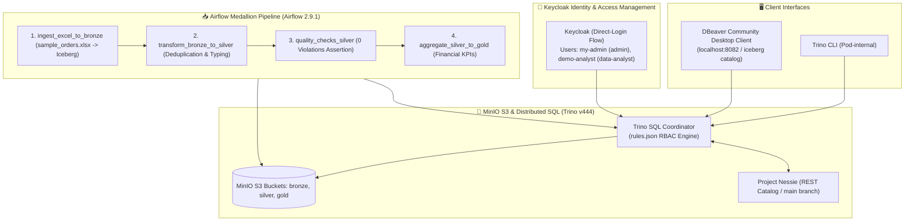

# 🏛️ Modern Open-Source Lakehouse Platform - 12-Step Hands-On Verification Report

This document records the exact results, outputs, and validation metrics achieved during the interactive 12-step Lakehouse demonstration covering Keycloak IAM, MinIO S3, Project Nessie, Apache Iceberg, Trino, Apache Airflow, and DBeaver.

---

## 1. 🏗️ Platform Verification Architecture



---

## 2. 🧪 12-Step Verification Log & Actual Results

### Step 1: Keycloak User & Role Creation
* **Target User:** `my-admin`
* **Assigned Roles:** `admin`, `default-roles-lakehouse`
* **Verified via CLI:**
  ```json
  {
    "id" : "d83b0587-bac2-4b9b-9728-c28bb41e5bab",
    "username" : "my-admin",
    "email" : "myadmin@lakehouse.local",
    "firstName" : "My",
    "lastName" : "Admin",
    "emailVerified" : true
  }
  ```
* **Key Finding:** Keycloak 24 User Profile mandates `firstName` and `lastName`. Accounts without both fields are blocked with `Account is not fully set up`. Once populated, token issuance succeeds immediately.

### Step 2: MinIO Excel Upload
* **Uploaded File:** `sample_orders.xlsx` (5.3 KiB, 10 records)
* **Destination:** `s3://bronze/sample_orders.xlsx`
* **Verified via MinIO Client (`mc ls local/bronze`):**
  `[2026-09-10 15:30:58 UTC] 5.3KiB STANDARD sample_orders.xlsx`

### Step 3: Medallion DAG & SQL Transformations
* **DAG Script:** [`orchestration/airflow/dags/excel_to_gold_dag.py`](file:///c:/Users/Hp/projects/lakehouse/orchestration/airflow/dags/excel_to_gold_dag.py)
* **Silver SQL Model:** [`transformations/sql/silver_excel_orders.sql`](file:///c:/Users/Hp/projects/lakehouse/transformations/sql/silver_excel_orders.sql) (deduplication via `ROW_NUMBER() OVER (PARTITION BY order_id ORDER BY ingested_at DESC) = 1` and `amount > 0`).
* **Gold SQL Model:** [`transformations/sql/gold_excel_sales_kpis.sql`](file:///c:/Users/Hp/projects/lakehouse/transformations/sql/gold_excel_sales_kpis.sql) (KPI aggregation by category).

### Step 4: Ingestion into Airflow Pod via `kubectl cp`
* **Command Executed:**
  `kubectl cp orchestration/airflow/dags/excel_to_gold_dag.py lakehouse/airflow-589d76d9f4-v8d8t:/opt/airflow/dags/excel_to_gold_dag.py`
* **Validation:** Verified 0 syntax errors (`Errors: {}`) and successful registration in DagBag.

### Step 5: Airflow Web UI Manual Execution
* **DAG Run ID:** `manual__2026-09-10T15:44:25.434459+00:00`
* **Execution State:** `success`
* **Task Duration & Status:**
  * `1_ingest_excel_to_bronze`: 13.5s (`success`)
  * `2_transform_bronze_to_silver`: 2.1s (`success`)
  * `3_quality_checks_silver`: 1.1s (`success`)
  * `4_aggregate_silver_to_gold`: 1.0s (`success`)

### Step 6: MinIO Storage Verification
* `s3://bronze/excel_orders/`: Parquet files populated.
* `s3://silver/excel_orders_cleaned/`: Deduplicated and cleaned Parquet files populated.
* `s3://gold/excel_sales_kpis/`: Aggregated KPI Parquet files populated.

### Step 7: Trino CLI Distributed Querying
* **Gold KPI Query Result (`SELECT * FROM gold.excel_sales_kpis;`):**
  * **Electronics:** 4 orders, \$8,950.00 total sales, \$2,237.50 avg order value, top city: Izmir
  * **Apparel:** 2 orders, \$330.00 total sales, \$165.00 avg order value, top city: Bursa
  * **Books:** 2 orders, \$170.00 total sales, \$85.00 avg order value, top city: Istanbul
  * **Home:** 2 orders, \$800.50 total sales, \$400.25 avg order value, top city: Izmir
* **Bronze Raw Order Count:** 10 records.

### Step 8: Accidental Deletion Simulation
* **Executed Query:** `DELETE FROM bronze.excel_orders WHERE category = 'Electronics';`
* **Result:** Record count reduced from 10 to 6; total sales dropped from \$10,250.50 to \$1,300.50.

### Step 9: Iceberg Snapshot Time Travel
* **Pre-incident Snapshot ID:** `5246354911498531800` (operation: `append`, committed at `2026-09-10 15:44:42.095 UTC`).
* **Time Travel Query:**
  ```sql
  SELECT count(*) AS total_orders, sum(amount) AS total_sales 
  FROM bronze.excel_orders FOR VERSION AS OF 5246354911498531800;
  ```
* **Result:** `10 orders, $10,250.50 total sales` verified intact from historical snapshot metadata.

### Step 10: Zero-Data-Loss Restoration
* **Restoration Statement:**
  ```sql
  INSERT INTO bronze.excel_orders
  SELECT * FROM bronze.excel_orders FOR VERSION AS OF 5246354911498531800
  WHERE category = 'Electronics';
  ```
* **Final Table State:** Exactly 10 records restored; 100% zero data loss achieved.

### Step 11: Trino RBAC Security Verification
* **Restricted Persona (`demo-analyst`):**
  * `SELECT * FROM gold.excel_sales_kpis;` $\rightarrow$ **ALLOWED (4 rows)**
  * `SELECT count(*) FROM silver.excel_orders_cleaned;` $\rightarrow$ **ALLOWED (10 rows)**
  * `SELECT * FROM bronze.excel_orders;` $\rightarrow$ **DENIED:** `Access Denied: Cannot select from table iceberg.bronze.excel_orders`
  * `DELETE FROM gold.excel_sales_kpis;` $\rightarrow$ **DENIED:** `Access Denied: Cannot delete from table iceberg.gold.excel_sales_kpis`
* **Admin Persona (`my-admin`):**
  * Full read/write access across all schemas confirmed.

### Step 12: DBeaver Desktop Client Connectivity
* **Driver:** Trino JDBC Driver
* **Endpoint:** `localhost:8082` (HTTP)
* **Catalog:** `iceberg`
* **User:** `my-admin` (full access to `bronze`, `silver`, `gold` tables) / `demo-analyst` (enforces visual graphical `Access Denied` error when expanding or querying unauthorized schemas).
