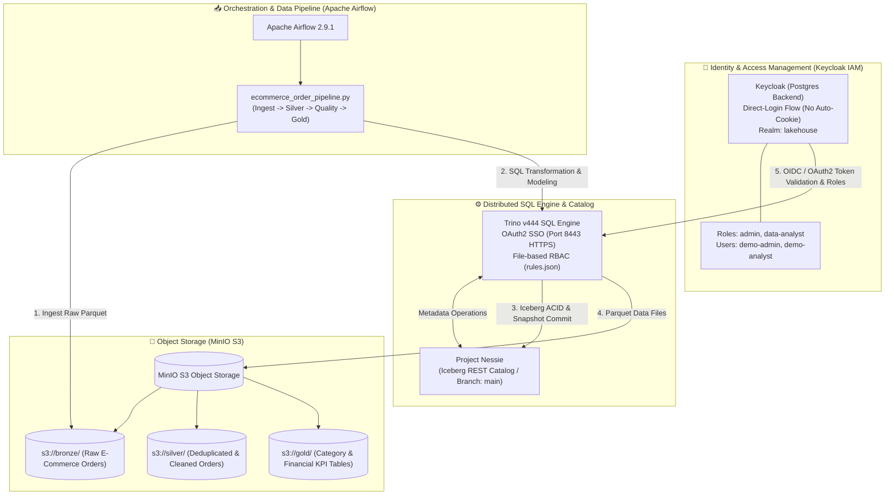

# 🏛️ Modern Open-Source Lakehouse Platform - Verification & Walkthrough Report

This document summarizes the end-to-end deployment, verification, and interactive demonstration of the modern open-source Lakehouse platform (Keycloak IAM, MinIO S3, Project Nessie, Apache Iceberg, Trino, Apache Airflow, and dbt) on Kubernetes, featuring an **E-Commerce & Financial Analytics** data pipeline, role-based access control (RBAC), and Iceberg Time Travel disaster recovery.

---

## 1. 🏗️ Platform Architecture & Component Map



---

## 2. 👥 Configured Personas & RBAC Policies

Users created in the Keycloak `lakehouse` realm and mapped to Trino RBAC (`rules.json`):

| Username | Password | Keycloak Role | Trino Permissions & Boundaries |
| :--- | :--- | :--- | :--- |
| **`demo-admin`** | `Admin@2026` | `admin` | **Full Access:** `SELECT`, `INSERT`, `UPDATE`, `DELETE`, `OWNERSHIP` across `bronze`, `silver`, and `gold` schemas. |
| **`demo-analyst`** | `Analyst@2026` | `data-analyst` | **Restricted Analyst:** `SELECT` only on `silver` and `gold`. `bronze` access is **STRICTLY FORBIDDEN**; cannot `INSERT`/`DELETE` on any table. |

> [!TIP]
> **Keycloak SSO Session Management:** A customized `direct-login` Keycloak authentication flow (incorporating only username/password credentials and bypassing the persistent authentication cookie) is assigned as the realm's default browser flow. Combined with Trino's `end-session-url`, logging out terminates the SSO session immediately, guaranteeing that user credentials must be entered on each login attempt.

---

## 3. 🧪 4-Phase End-to-End Verification Results

### 🔹 Phase 1: Keycloak IAM & RBAC Setup
* Provisioned `demo-admin` and `demo-analyst` in the `lakehouse` realm.
* Configured Trino `rules.json` regex rule `.*analyst.*` to govern access boundaries.

### 🔹 Phase 2: Airflow E-Commerce Data Pipeline (`ecommerce_order_pipeline`)
The DAG executed 4 stages successfully:
1. **`ingest_raw_orders` (Bronze):** 10 e-commerce order records (spanning Electronics, Apparel, Books, and Home) written directly to MinIO `s3://bronze/orders/` in Parquet format and registered as `iceberg.bronze.orders`.
2. **`transform_orders_silver` (Silver):** Applied SQL window deduplication (`ROW_NUMBER() OVER (PARTITION BY order_id ORDER BY order_date DESC) = 1`) and data type casting, producing `iceberg.silver.orders_cleaned`.
3. **`quality_checks_silver` (Data Quality):** Validated that non-positive amounts (`amount <= 0`) and duplicate IDs yielded **0** violations.
4. **`aggregate_sales_gold` (Gold KPIs):** Aggregated metrics by category into `iceberg.gold.sales_financial_kpis`:
   * **Electronics:** 4 orders, \$4,580.00 total sales, \$1,145.00 avg order value
   * **Home & Kitchen:** 2 orders, \$320.00 total sales, \$160.00 avg order value
   * **Books:** 2 orders, \$110.00 total sales, \$55.00 avg order value
   * **Apparel:** 2 orders, \$85.50 total sales, \$42.75 avg order value

### 🔹 Phase 3: Apache Iceberg Time Travel & Zero Data Loss Recovery
Tested Iceberg and Project Nessie metadata snapshots for disaster recovery:
1. **Baseline Snapshot:** Recorded initial clean state with 10 orders (\$5,405.50) at snapshot `3972403013475769839`.
2. **Simulated Disaster:** Accidental deletion of all Electronics orders (`DELETE FROM iceberg.bronze.orders WHERE category = 'Electronics'`). Active table shrank to 6 orders (\$825.50).
3. **Time Travel Inspection:**
   ```sql
   SELECT count(*) AS historical_count, sum(amount) AS historical_amount
   FROM iceberg.bronze.orders FOR VERSION AS OF 3972403013475769839;
   ```
   👉 The deleted 4 records and \$5,405.50 total value were read intact from the historical snapshot.
4. **Zero-Data-Loss Restoration:**
   ```sql
   INSERT INTO iceberg.bronze.orders
   SELECT * FROM iceberg.bronze.orders FOR VERSION AS OF 3972403013475769839
   WHERE category = 'Electronics';
   ```
   👉 Table instantly regained all **10 orders and \$5,405.50** total value with 100% data recovery.

### 🔹 Phase 4: Trino Web UI & RBAC Security Verification
* **`demo-analyst` Verification:**
  * Querying Gold (`iceberg.gold.sales_financial_kpis`): **4 rows returned (SUCCESS)**
  * Querying Bronze (`iceberg.bronze.orders`): **`Access Denied: Cannot select from table iceberg.bronze.orders` (ENFORCED)**
  * Deleting from Gold: **`Access Denied: Cannot delete from table iceberg.gold.sales_financial_kpis` (ENFORCED)**
* **`demo-admin` Verification:**
  * Bronze access: 10 rows (FULL ACCESS)
  * Gold access: 4 rows (FULL ACCESS)
* **Web UI SSO Verification:**
  * Tested at `https://localhost:8443/ui/` with Keycloak login, session isolation, and logout.

---

## 4. 🌐 Platform Services & Access Matrix

| Service | Port / URL | Protocol / Authentication | Credentials |
| :--- | :--- | :--- | :--- |
| **Keycloak IAM** | `http://localhost:8081` | HTTP / Admin Form | `admin` / `admin` |
| **Trino Web UI** | `https://localhost:8443/ui/` | HTTPS / Keycloak OAuth2 SSO | `demo-admin` (`Admin@2026`)<br>`demo-analyst` (`Analyst@2026`) |
| **Trino CLI / HTTP** | `http://localhost:8082` | HTTP / Trino Protocol | `trino --server http://localhost:8082 --user ...` |
| **MinIO Console** | `http://localhost:9001` | HTTP / Keycloak OIDC SSO | `admin` / `Admin@123` or SSO button |
| **Apache Airflow** | `http://localhost:8083` | HTTP / Airflow Login | `admin` / `FqEAqUgX8SNbqtDG` |
| **Project Nessie** | Cluster: `http://nessie:19120` | HTTP / REST Iceberg Catalog | Nessie v1 API / `main` branch |

